<link rel="stylesheet" href="styles.css" />
<h1
id="exercise-2-advanced-planning-with-data-actions-and-multi-actions">Exercise
2 – Advanced Planning with Data Actions and Multi Actions </h1>

<strong>Objective:</strong> You will develop a basic understanding
how to create and execute data action and multi actions. You will
explore data action tracing, which is useful for debugging data actions
and will create parameters to streamline the execution of data/multi
actions

<strong>Estimated Time:</strong> 45 mins

<strong>Exercise Description:</strong>  Now that the sales quantity
has been uploaded to the sales model, we are going to create a data
action to calculate sales revenue and an allocation to distribute retail
returns to the product level based on our expected sales revenue. In the
last step of the exercise, we will transfer our sales plan to our
financial plan.

<strong>Key Features:</strong>

<ul>
<li>
Creation of data action to streamline calculations.

<ul>
<li>
Create data action parameters to streamline execution.
</li>
<li>
Create a simple advanced formula for sales revenue
calculation.
</li>
<li>
Create an allocation rule to allocate retail expenses.
</li>
<li>
Creating a cross model copy rule, which aggregates data based on
region.
</li>
</ul></li>
<li>
Executing a trace on a data action and reviewing
results.
</li>
<li>
Creating a multi-action to orchestrate data actions.
</li>
<li>
Format trigger within the story and map parameters.
</li>
</ul>

⚠️<strong>Disclaimer</strong> When completing exercises, it is
expected that data values or screenshots should match what you see on
your screen. If you see inconsistencies as you work through the
exercise, please refer to the appropriate section in <strong>Getting
Started</strong> Readme. For any inconsistencies which are not addressed
therein, please check with your instructor.

🚩As a FP&amp;A Analyst for CycleBros, we are interested in
automating the calculation framework for our planning scenario. We will
automate the calculation via data and multi actions, which we will
create as part of this exercise. We will learn how to execute traces on
data actions and then how to include all this logic into a story.

Let’s start by editing the dashboard to show the finance plan. This
will make it easy to eventually see how our sales planning activities
transfer to the finance plan near the end of the exercise.

<ol start="6" type="1">
<li>
We are now going to adjust the layout of the sales planning
table. Our first step will be select the table object, select edit mode
for the story, the right design panel and then the builder panel. This
will allow us to redefine the definition of the table object.
</li>
</ol>

<ol start="7" type="1">
<li>
Adjust the table definition to match the definition provided
below. For <strong>Account</strong>, we will filter on Gross Revenue and
for <strong>Measures</strong> we will filter on Quantity and
Amount.
</li>
</ol>

<ol start="8" type="1">
<li>
We will enable null suppression to remove the null rows from the
report.
</li>
</ol>

<ol start="9" type="1">
<li>
We will now collapse the hierarchy of the report so that we are
only looking at an overview of our sales plan.
</li>
</ol>

<ol start="10" type="1">
<li>
Once we close the right builder pane and resize the table, your
results should look like this:
</li>
</ol>

<ol start="11" type="1">
<li>
We are now going to create a table that shows our Finance data.
As part of this exercise, we are going to integrate our sales plan into
the finance plan so we will add a table showing finance data so we can
showcase this integration. To begin, we will duplicate the Sales
Quantity table, reposition it and then open up the builder panel so we
can select our finance model.
</li>
</ol>

<ol start="12" type="1">
<li>
Acknowledge the warning and then select the finance
model.
</li>
</ol>

<ol start="13" type="1">
<li>
Set the table layout and filters as shown
</li>
</ol>
<blockquote>

</blockquote>
<ol start="14" type="1">
<li>
Rename the table to Finance () and then add dynamic text between
the “()” for the version.
</li>
</ol>
<blockquote>

</blockquote>
<ol start="15" type="1">
<li>
Select the Version item from the Input Controls
selections.
</li>
</ol>
<blockquote>

</blockquote>

⚠️ <strong>Quality Check!</strong> Does your refreshed dashboard
(including upload results) look like this? Note: The right planning
panel may need to be de-selected from the meu to replicate this
view.

<ol start="16" type="1">
<li>
Save your story.
</li>
</ol>
<blockquote>

</blockquote>
<ol start="17" type="1">
<li>
From the main menu, select <strong>Files</strong>, our
<strong>Workspace</strong>, then DA261-User Content and then your user
folder. We can now select the “+” button to add a Data Action. This data
action will be used to calculate gross sales based on quantity and
price. We will then extend this data action to allocate Retail Returns
to the subregions of the United States based on our calculated Gross
Sales values.
</li>
</ol>

<ol start="18" type="1">
<li>
Enter a name like “Calculate_Sales_&amp;_Returns” and select the
Sales Model from the model folder within our workspace. This is the same
sales model we were using when we were creating our story. When
complete, save the data action to your folder.
</li>
</ol>

<ol start="19" type="1">
<li>
Validate that you are saving the data action to your user
folder.
</li>
</ol>

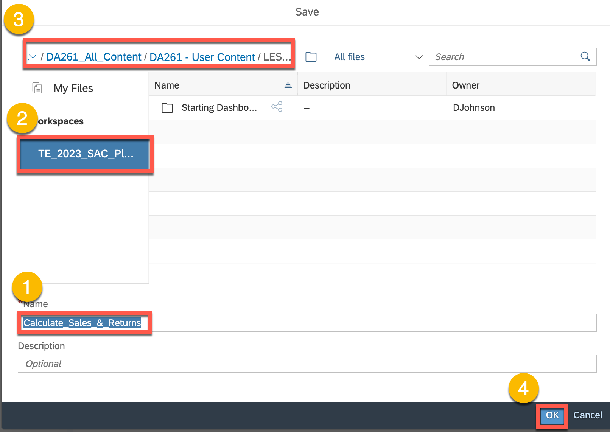

<ol start="20" type="1">
<li>
We are going to add an advanced formulae to calculate gross sales
from quantity and price. We are going to open the content menu so we can
restrict the scope of the calculation.
</li>
</ol>

<ol start="21" type="1">
<li>
However, before we restrict the context, we are going to create a
parameter to restrict the calculation to our user id.
</li>
</ol>

<ol start="22" type="1">
<li>
Give your parameter a name like “User” and then make the
appropriate settings as shown. When complete save your Data Action.
Select the advanced formula item that we were starting to configure
before we created our parameter.
</li>
</ol>

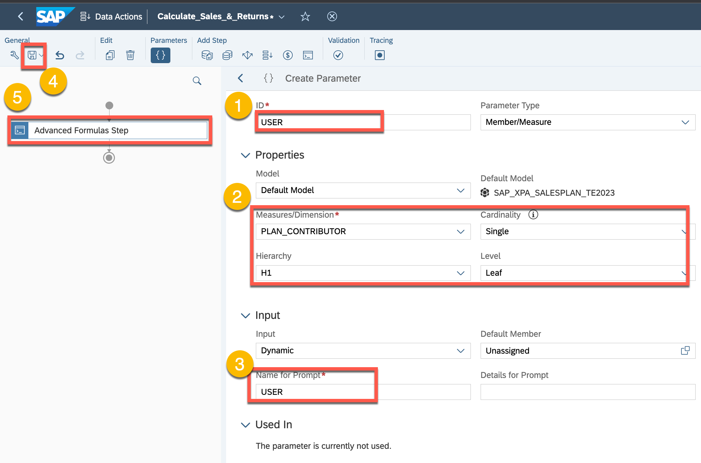

<ol start="23" type="1">
<li>
Give the step a name like “Calculate Sales”. Next configure the
context as shown. Note that for the PLAN_CONTRIBUTOR. You will need to
select the USER parameter you have just created from the parameter list
within the selection popup. Once the context is set, we will start the
process of building a graphical calculation to calculate gross
sales.
</li>
</ol>

<ol start="24" type="1">
<li>
We are going to calculate the Gross Sales Amount by taking the
price, which is stored at the Unassigned region multiplied by the sales
quantity we uploaded from our excel file.
</li>
</ol>

⚠️<strong>Quality Check!</strong> Please check that your advanced
formula is identical to what is shown below.

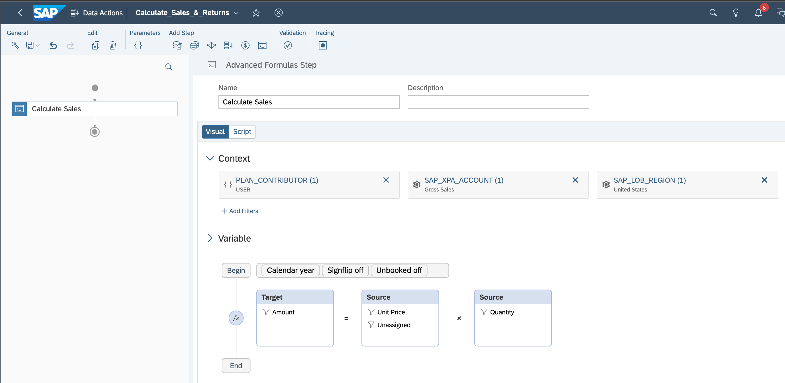

<ol start="25" type="1">
<li>
We are now going to add an allocation step so that we can
allocate retail returns to our sub-regions (i.e. North, East, South and
West).
</li>
</ol>

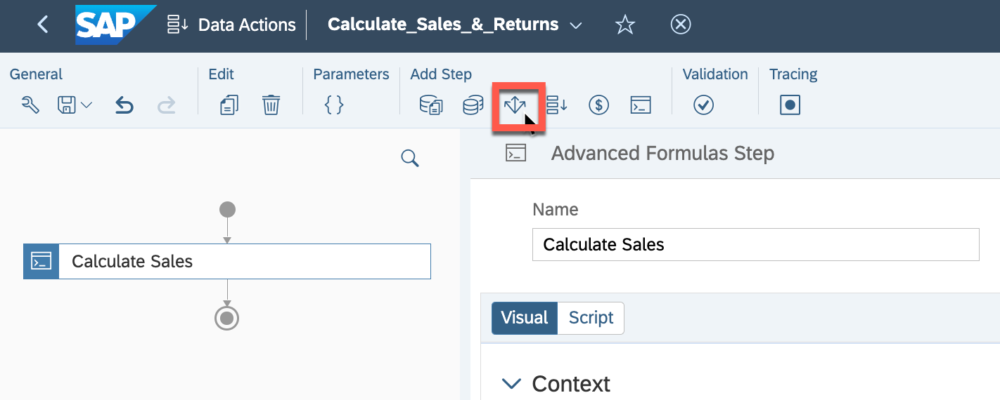

<ol start="26" type="1">
<li>
Configure the allocation rules as shown and then save your rule.
In this case, we have already planned retail return values for 2024 for
the entire region, which is stored in the Unassigned region. We are
going to allocate these values by the gross sales we previously
calculated for each subregion.
</li>
</ol>

<ol start="27" type="1">
<li>
We are now going to set the trace points on the data
actions.
</li>
</ol>

<ol start="28" type="1">
<li>
Set the trace points as shown by selecting these areas on the
data action flow. This will allow us to see data action changes between
steps.
</li>
</ol>

<ol start="29" type="1">
<li>
We can also select trace points within advanced formulas. Here we
are going to set a trace point where we are calculating gross sales.
Notice that we also see a new tracing point added on the Tracing pane on
the right side of the screen.
</li>
</ol>

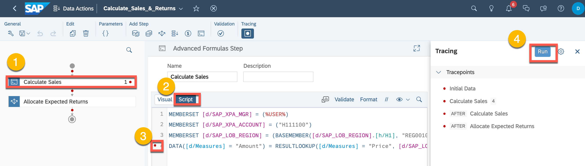

<ol start="30" type="1">
<li>
Please select the 2024 Plan and your User ID for the data input
parameters.
</li>
</ol>

<ol start="31" type="1">
<li>
We are now going to select the Show Table to Review the results
of the first step. Notice that our selection parameters will be shown in
the right pane for transparency.
</li>
</ol>

⚠️<strong>Quality Check!</strong> Please check that your trace window
should be identical to what is shown below.

<ol start="32" type="1">
<li>
As we configure the table, you may need to change the
<strong>Display Options</strong> to
<strong>Description</strong>.
</li>
</ol>

<ol start="33" type="1">
<li>
Configure the table as shown. Notice that price is stored at the
unassigned region and that the Amount has not been calculated.
</li>
</ol>

<ol start="34" type="1">
<li>
Select the tracing point for Calculate_Sales. Here we will see
the results tracepoint for the calculation we created in our advanced
formula. If we had multiple calculation lines in our advanced formula,
we could have set multiple trace points. Also note that we can also
explore the calculation scope for our advanced formula on the right
pane.
</li>
</ol>

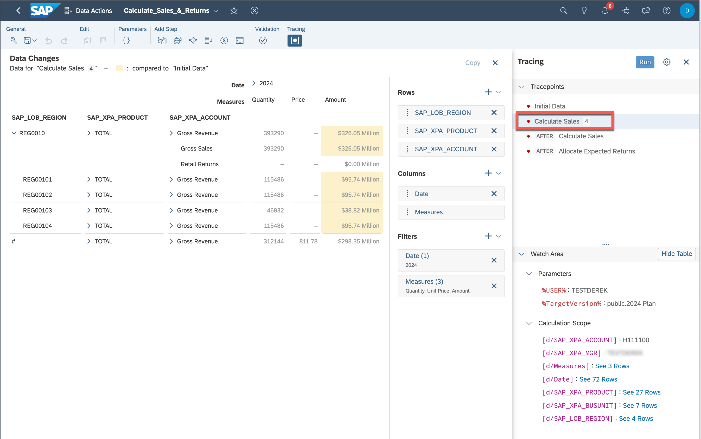

<ol start="35" type="1">
<li>
If you would like, you can also select values from the Watch Area
table and use the copy button to copy them to the clipboard. These
values can be then pasted into a document like Excel for further
analysis. While we are showing this capability, we have not included
exercise steps to paste these values into other documents.
</li>
</ol>

<ol start="36" type="1">
<li>
Next, we are going to select the tracing steps after our
Calculate_Sales advanced formulas has executed. As we only have one
calculation in our advanced formula, the results of this table should
match the previous trace point. Notice that we do not see any values for
Retail Returns as this will be addressed in our allocation
step.
</li>
</ol>

<ol start="37" type="1">
<li>
Selectin the AFTER Allocate Expected Returns, we can see that the
Retail Returns from the unassigned region (i.e. ‘#’), to each of the
subregions based on Gross Sales.
</li>
</ol>

<ol start="38" type="1">
<li>
The Trace creates a private version, which can be viewed in the
story we created. Since we will not be doing anything with this this
trace version we will delete the information.
</li>
</ol>

<ol start="39" type="1">
<li>
In case you have not done so before, please <strong>Save</strong>
your data action. When we created the data action, we did it from our
personal folder we created in our workspace. As the next step, we are
going to create another <strong>Data Action</strong> to load the sales
plan into the finance plan. We will perform this step from the main menu
to initiate the build activity and then save it to our personal
folder.
</li>
</ol>

<ol start="40" type="1">
<li>
Xxxx
</li>
</ol>

<ol start="41" type="1">
<li>
Please give the data action a name like “ Cross-Model Copy Step”
and then select our Finance model from the exercise.
</li>
</ol>

<ol start="42" type="1">
<li>
We are going to save this data action to our personal folder.
Note that when creating models, stories and data/multi-actions, that
these objects can be stored within a file structure for easy
organization.
</li>
</ol>

<ol start="43" type="1">
<li>
We are going to create some parameters for the data action. This
will allow us to better control the scope of the data action.
</li>
</ol>

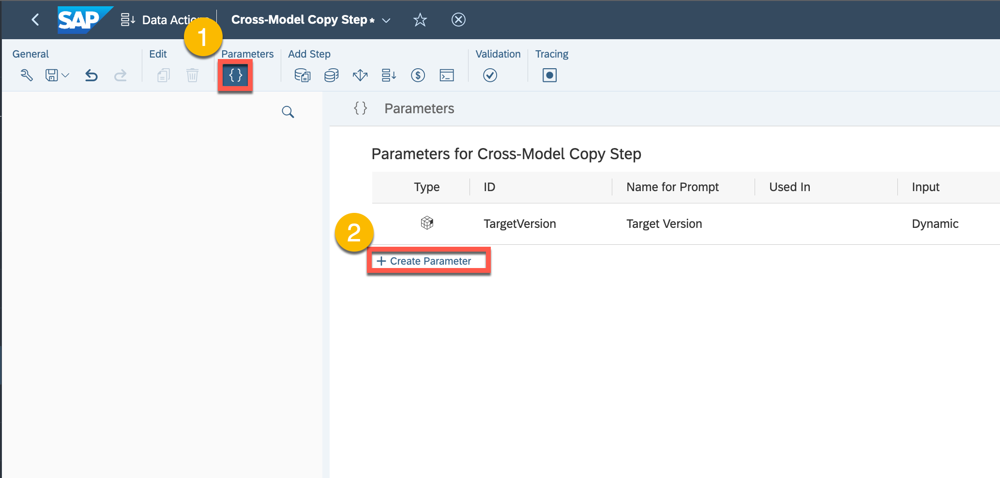

<ol start="44" type="1">
<li>
To create a parmeter, we will give it a name, set the model to
our sales planning model (i.e. SAP_XPA_SALESPLAN_TE2023). We will then
select our dimension (i.e. PLAN_CONTRIBUTOR) and set the cardinality to
single (vs. multiple values) and the level being a leaf member. As the
sales plan for the purpose of this exercise is organized by user, this
will allow us to pass our user to the data action to restrict its
scope.
</li>
</ol>

<ol start="45" type="1">
<li>
We are going to create another parameter for source version. As
we are creating a data action to copy data between models, this
parameter will be used to indicate which version we would like to copy
from the sales plan.
</li>
</ol>

<ol start="46" type="1">
<li>
Please give the parameter a name, such as “SVersion” and set the
model to SAP_XPA_SALESPLAN_TE2023. We are going to assign the dimension
to Version and the cardinality to single, which means we only want to
pass a single value via this parameter. We will then enter the default
value of “2024 Plan.” Although we have set a default value, the user can
override this value when the data action is executed.
</li>
</ol>

<ol start="47" type="1">
<li>
We are now going to create our <strong>cross-model copy</strong>
step to copy data from our sales plan to our finance plan.
</li>
</ol>

<ol start="48" type="1">
<li>
Please give the parameter a name, such as “<strong>Sales 2
Finance</strong>” and set the model to SAP_XPA_SALESPLAN_TE2023. We are
going to assign set the filters for <strong>Version</strong> and Plan
<strong>Contributor</strong> as shown. When selecting the filter value,
you will need to select <strong>Parameters</strong> on the pane on the
left side of the popup window to select the parameters you have
previously created.
</li>
</ol>

<ol start="49" type="1">
<li>
Using drag and drop, map the source dimension to the target
dimensions. Note that you will not be able to map SAP_XPA_COSTCENTER as
this dimension is not included in the finance model. We will want to
select this dimension and manually map it to the <strong>Sales &amp;
Marketing</strong> cost center.
</li>
</ol>

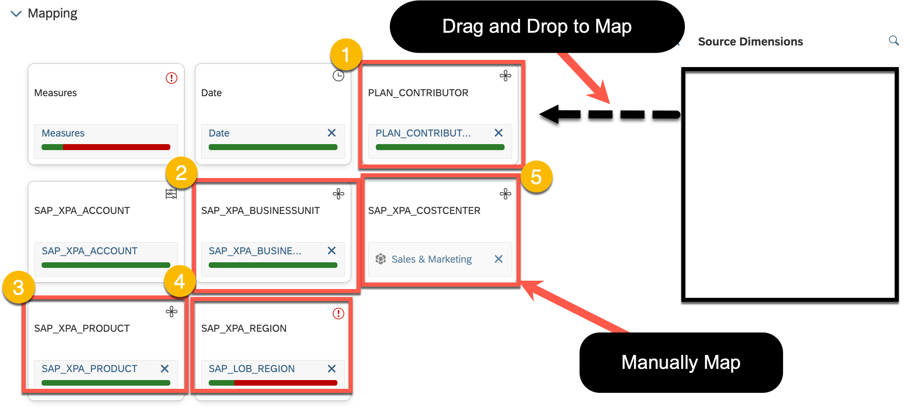

<ol start="50" type="1">
<li>
Select the measures mapping so we can edit the mapping
rules.
</li>
</ol>

<ol start="51" type="1">
<li>
We are going to create a user defined rule to map the Amount from
the sales plan to Local Currency in our finance plan. We are also going
to set the auto-generation strategy to “<strong>Identical Names and
Compatible Types.</strong>” We could have also filtered on measures when
creating the rule to just include Quantity and Amount as well.
</li>
</ol>

<ol start="52" type="1">
<li>
Now select the SAP_LOB_REGION. Here we have the issue that we
have sub-regions assigned to the United States in our sales plan that
have been aggregated to just the United States in our finance
plan.
</li>
</ol>

<ol start="53" type="1">
<li>
For the region, select “Identical names (including Ancestors)” to
map the subregions from the sales plan to the region in the finance
plan. Using this strategy, we can plan at a different level in our sales
plan than our finance plan.
</li>
</ol>

<ol start="54" type="1">
<li>
If you have not already done so, please save your plan and then
select the <strong>Multi Actions</strong> from the main menu as shown.
With the multi-action, we can bind data actions that we created for our
sales and finance model into a single action we can trigger in a
story.
</li>
</ol>

<ol start="55" type="1">
<li>
We are going to create a new Multi Action.
</li>
</ol>

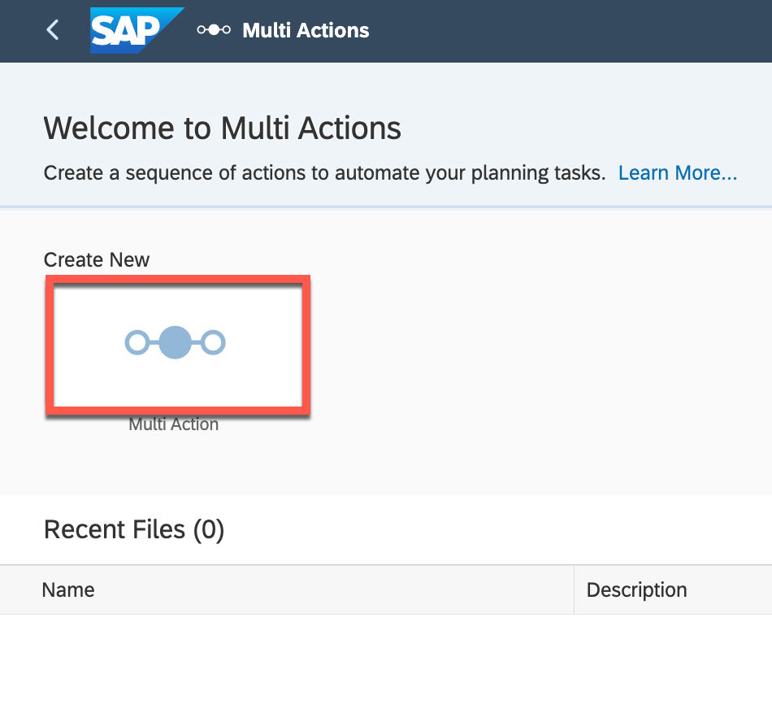

<ol start="56" type="1">
<li>
Before we add the data actions we previously created to our
multi-action, we are going to create some parameters to orchestrate the
execution.
</li>
</ol>

<ol start="57" type="1">
<li>
We are going to create parameter called “SVersion” that will be
used transfer what source version we would like to use from our sales
plan. Please enter the values as shown below.
</li>
</ol>

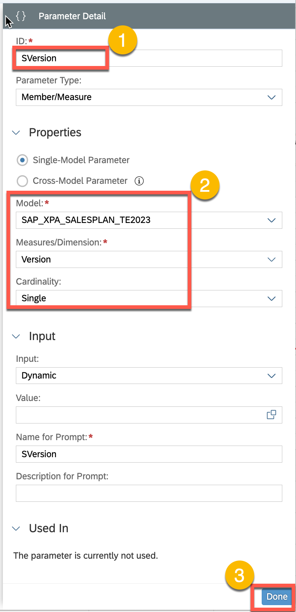

<ol start="58" type="1">
<li>
We are now going to add another parameter for our userID. While
we would not normally run a data action by user id, we have added this
parameter as we have many participants running data actions for this
exercise and want to carefully limit our scope.
</li>
</ol>

<ol start="59" type="1">
<li>
Please create the parameter as shown below.
</li>
</ol>

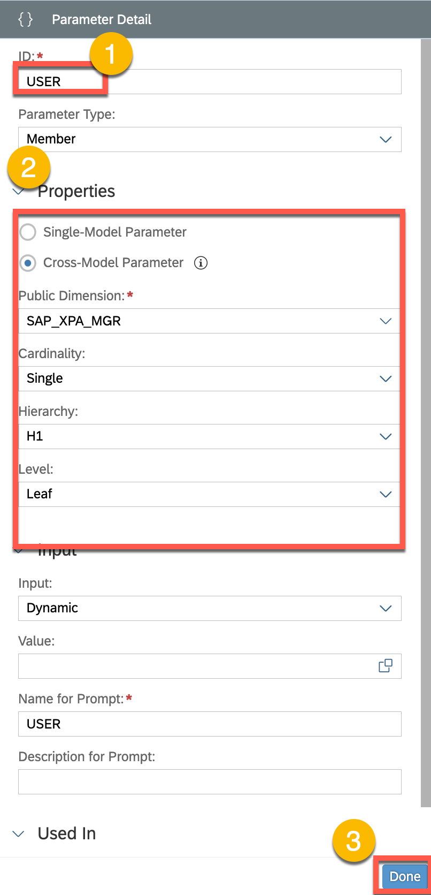

<ol start="60" type="1">
<li>
We are now going to create another parameter for the target
version. Note that for this exercise we could have just hard-coded these
values, but have chosen to include them as parameters to make them more
dynamic.
</li>
</ol>

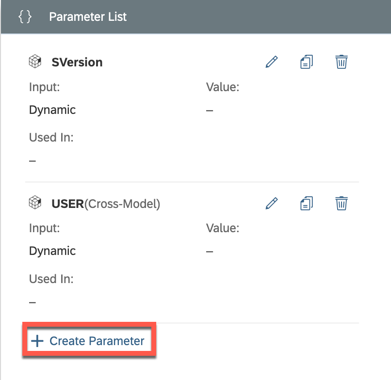

<ol start="61" type="1">
<li>
Please create the version as shown below.
</li>
</ol>
<blockquote>

</blockquote>
<ol start="62" type="1">
<li>
Select the + button and then add a <strong>Data Action
Step</strong>. This is where we will start to attach the data actions we
previously created to the multi-action.
</li>
</ol>

<ol start="63" type="1">
<li>
Select the data action that you have previously created, which
should be stored in your user folder. Please configure the parameters as
well.
</li>
</ol>

<ol start="64" type="1">
<li>
We will now add another data action to our multi action. Note
that when we create a data action, we can only assign a single model to
it. When using a multi action, we can include many data action steps to
it, which may be bound to different models. Our first data action is
bound to the sales plan, whereas our second data action will be bound to
the finance plan model.
</li>
</ol>
<blockquote>

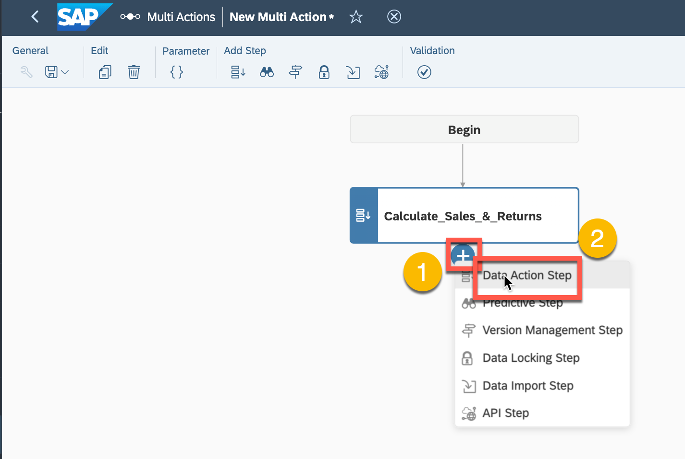

</blockquote>
<ol start="65" type="1">
<li>
Configure the data action as shown and then save the
multi-action. you will need to save the Multi Action to your personal
folder, which will be shown in the following step.
</li>
</ol>

<ol start="66" type="1">
<li>
Save the Multi Action to your personal folder. Please give it a
name like “Calc_Sales_and_Aggregate”
</li>
</ol>

<ol start="67" type="1">
<li>
Open your main user story that we created in the first part of
the exercise.
</li>
</ol>

<ol start="68" type="1">
<li>
Navigate to the second page of the worksheet related to
<strong>Sales Plan Entry</strong> and then select the
<strong>Edit</strong> button. We need to be in edit mode to add our
newly created multi-action into our story.
</li>
</ol>

<ol start="69" type="1">
<li>
Add a <strong>Multi Action Trigger</strong> as shown
below.
</li>
</ol>
<blockquote>

</blockquote>
<ol start="70" type="1">
<li>
Open up the right editing pane and then select your multi action
that you have just created form your personal folder. Assign the
parameters as shown below. Press the formatting button so we can format
the trigger in the next step.
</li>
</ol>

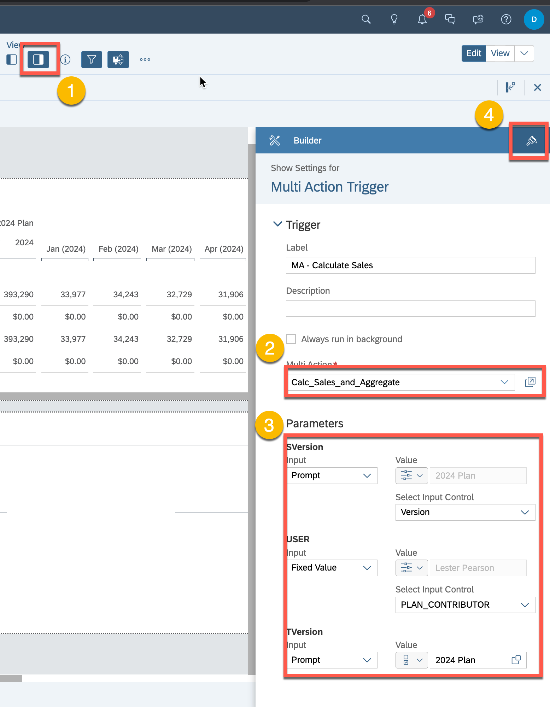

<ol start="71" type="1">
<li>
We are now going to format the trigger. While you are free to
select any color, we have provided a hex number as well for a particular
shade of blue.
</li>
</ol>

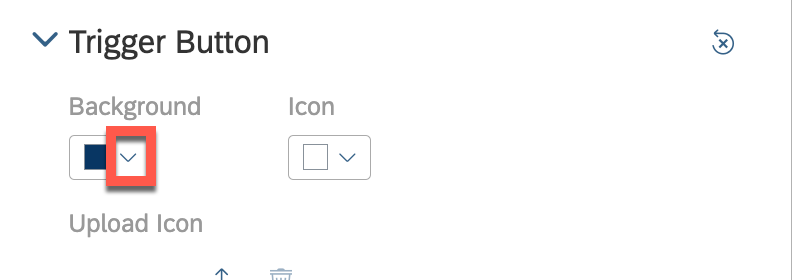

<ol start="72" type="1">
<li>
Please reposition the Multi Action and then <strong>Save</strong>
your story. We will then select the <strong>View</strong> mode as we get
ready to execute the Multi Action.
</li>
</ol>

Navigate to the Sales Plan Entry Page.

⚠️<strong>Quality Check!</strong> Please check that your sales story
page should be identical to what is shown below.

<ol start="73" type="1">
<li>
Press the <strong>Multi Action</strong> button to execute it. The
prompts in this case should be 2024 Plan for both the source and target
version.
</li>
</ol>

<ol start="74" type="1">
<li>
We should now see the sales plan values transferred to the
finance plan. We can expand the hierarchies to get a better sense of the
plan transfer.
</li>
</ol>

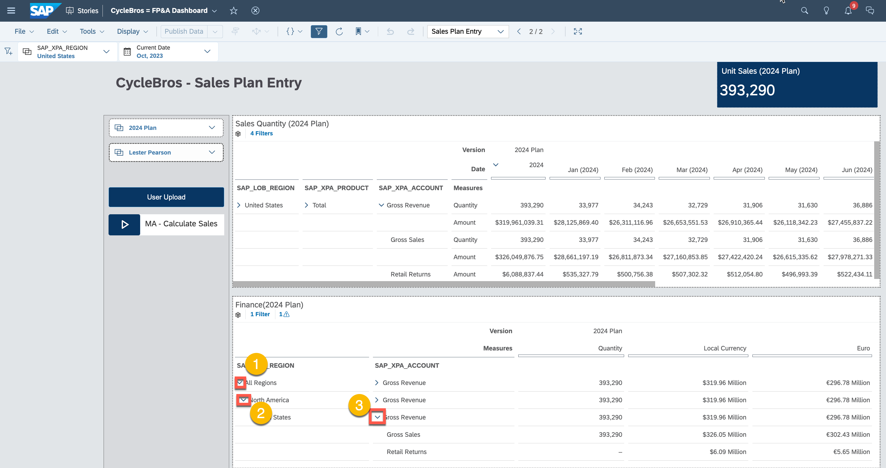

<h2 id="summary">Summary</h2>

<strong>Congratulations, you have completed Exercise 2!</strong>

<strong>You are now able to:</strong>

<ul>
<li>
Create and execute data and multi-actions.
</li>
<li>
Perform tracking on data action steps.
</li>
</ul>

Continue to Exercise 3 - XXXXXXXXXXXX
