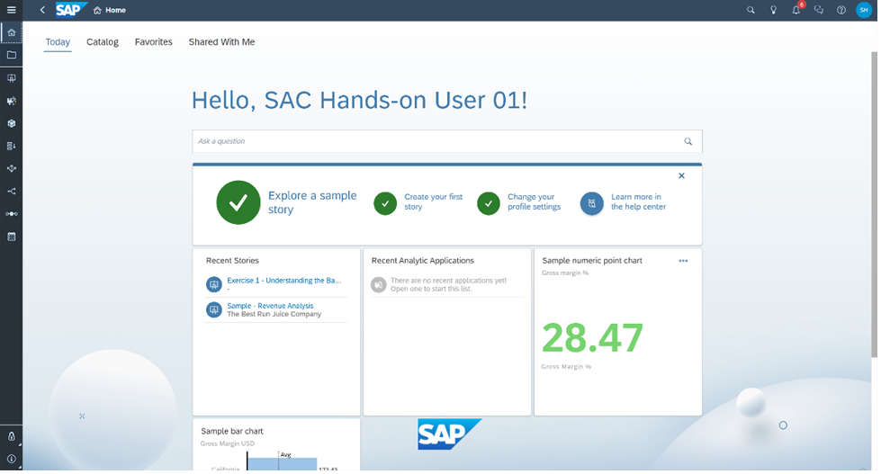
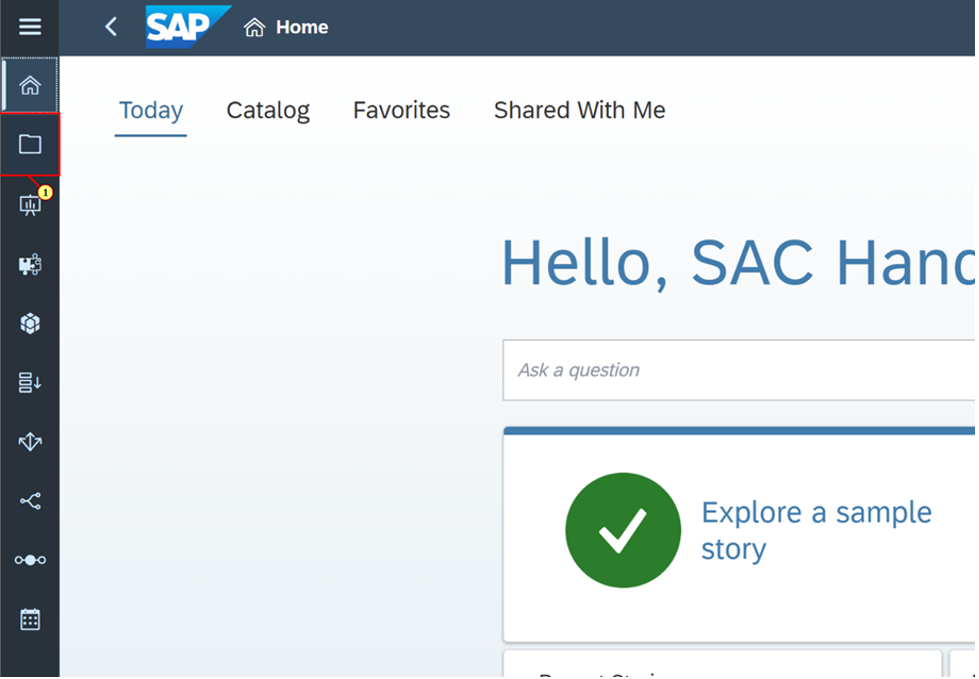
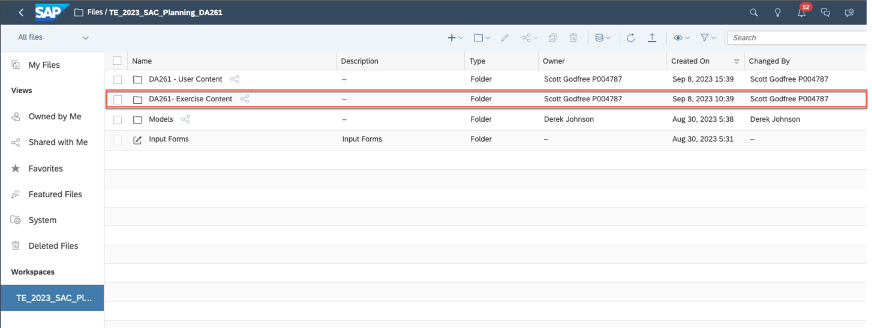
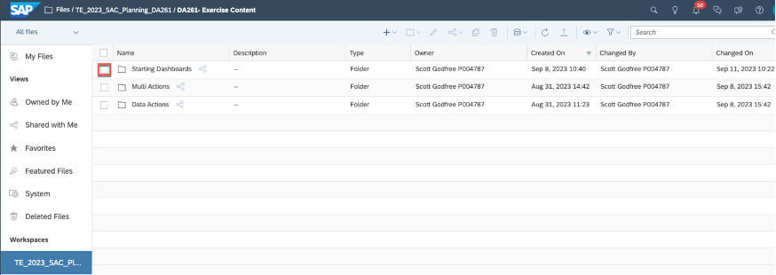
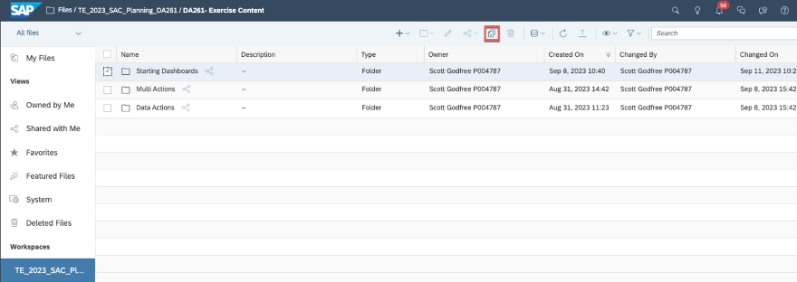
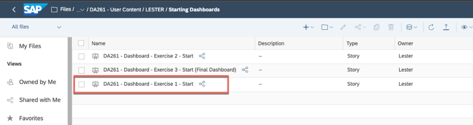
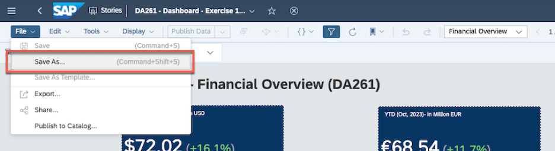
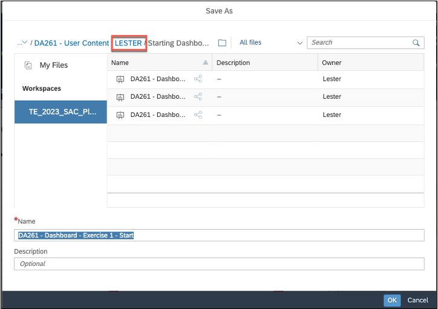
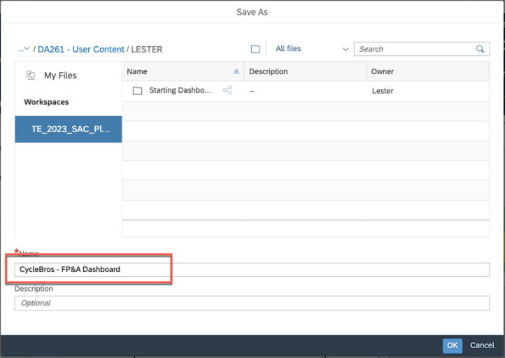
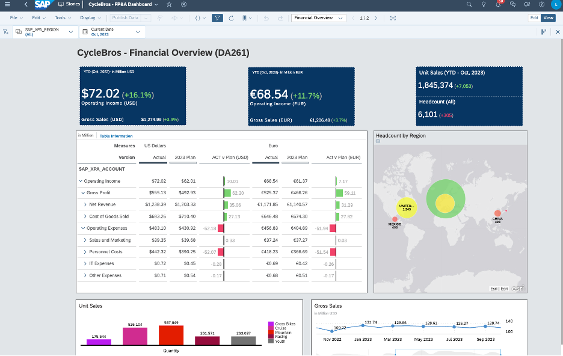

# **Getting Started**

**Objective:** Before we get started on the exercises, we will
show you how to get started in SAP Analytics Cloud and ensure that you are
ready for the exercises.

**Estimated Time:** 5 mins

**Key Outcomes:**

* Locate your files
* Create a copy of the starting dashboards to your local file repository.

⚠️ **Disclaimer:** When completing exercises, it is expected that data
values or screenshots should match what you see on your screen unless otherwise
noted below. If you see inconsistencies as you work through the exercise,
please refer to the appropriate section in this document.  For any inconsistencies which are not
addressed, please check with your instructor.

---

🚩 Welcome to
SAP Analytics Cloud! This is the homepage where you can explore a sample story,
create your first story, change your profile settings and so on.

1. First, you want
   to access existing dashboards that we have created for TechEd. In the left
   side panel, click the **Files** icon.

2. The stories
   that you will work on are located within the **Stories** folder within
   the Workspace TE_2023_SAC_Planning_DA261.   First select the appropriate workspace
   and click on the **DA261 Exercise Content** folder.

3. Within the
   folder you will see a starting dashboard, and dashboards to represent the
   expected results at the end of exercise 1 and exercise 2 respectively.  The data models used by the stories can
   be found in the **Models** folder within the root folder of the
   workspace.  In addition, you can see
   the data models that are used for the dashboards.  Let's start by creating a copy of the
   Starting Dashboard and copy that to your specific user folder under **User
   Dashboards** folder. Click on the checkbox for the  **Exercise 1
   Dashboard** .

5. Click on
   the [**Copy
   To** ]()icon

5. Click on **TE_2023_SAC_Plannning_DA261** to
   navigate back to the root folder.
   Click on the **DA261- User Content** folder, and then click on
   the subfolder relevant for your UserID (e.g.,  **USER01** )
   
7. Click **OK**
   
8. Click on **TE_2023_SAC_Plannning_DA261** to
   navigate back to the root folder.
   Click on the **DA261- User Content** folder, and then click on
   the subfolder relevant for your UserID (e.g.,  **USER01** )

9. Click on the
   dashboard, **DA261 – Dashboard – Exercise 1 –  Start**

10. Once the
   dashboard is open select the **Save As** from the File menu

11. Navigate back
    to the root folder for your user by clicking on your username in the file
    path at the top of the Save As dialog

12. Change the name
    of the file to **CycleBros – FP&A Dashboard **and click** OK**

13. You are ready
    to begin!

    

## Summary

**You have
completed the Getting Started section! Now you are ready to move on to the
exercises.**

Continue to Exercise 1 – Plan Story Navigation and
Enrichment
