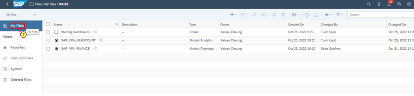
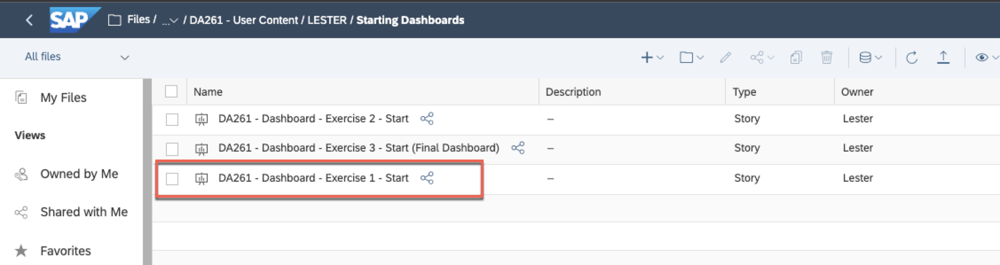

<link rel="stylesheet" href="styles.css" />

<strong>Getting Started</strong>

<strong>Objective:</strong> Before we get started on the exercises,
we will show you how to get started in SAP Analytics Cloud and ensure
that you are ready for the exercises.

<strong>Estimated Time:</strong> 5 mins

<strong>Exercise Description:</strong> Before we get started on the
exercises, we will introduce the homepage of SAP Analytics Cloud and
show where you can access your files and dashboards for the
exercises.

<strong>Key Outcomes:</strong>

<ul>
<li>
Locate your files
</li>
<li>
Create a copy of the starting dashboards to your local file
repository.
</li>
</ul>

⚠️<strong>Disclaimer</strong> When completing exercises, it is
expected that data values or screenshots should match what you see on
your screen unless otherwise noted below. If you see inconsistencies as
you work through the exercise, please refer to the appropriate section
in this document. For any inconsistencies which are not addressed,
please check with your instructor.

🚩 Welcome to SAP Analytics Cloud! This is the homepage where you can
explore a sample story, create your first story, change your profile
settings and so on.

<ol type="1">
<li>
First, you want to access existing dashboards that we have
created for TechEd. In the left side panel, click
the <strong>Files</strong> icon.
</li>
</ol>

<ol start="2" type="1">
<li>
The stories that you will work on are located within the
<strong>Stories</strong> folder within the Workspace
TE_2023_SAC_Planning_DA261. First select the appropriate workspace and
click on the <strong>DA261 Exercise Content</strong> folder.
</li>
</ol>

<ol start="3" type="1">
<li>
Within the folder you will see a starting dashboard, and
dashboards to represent the expected results at the end of exercise 1
and exercise 2 respectively. The data models used by the stories can be
found in the <strong>Models</strong> folder within the root folder of
the workspace. In addition, you can see the data models that are used
for the dashboards. Let's start by creating a copy of the Starting
Dashboard and copy that to your specific user folder under <strong>User
Dashboards</strong> folder. Click on the checkbox for
the <strong>Exercise 1 Dashboard</strong>.
</li>
</ol>

<ol start="4" type="1">
<li>
Click on the <strong>Copy To</strong> icon
</li>
</ol>

<ol start="5" type="1">
<li>
Click on <strong>TE_2023_SAC_Plannning_DA261</strong> to navigate
back to the root folder. Click on the <strong>DA261- User
Content</strong> folder, and then click on the subfolder relevant for
your UserID (e.g., <strong>USER01</strong>)
</li>
<li>
Click <strong>OK</strong>
</li>
</ol>
<ol start="7" type="1">
<li>
In order to access the copied story, click
<strong>TE_2023_SAC_Plannning_DA261</strong>, and click on the subfolder
for your user (e.g. <strong>USER01)</strong> 
</li>
</ol>

<ol start="8" type="1">
<li>
Click on the dashboard, <strong>DA261 – Dashboard – Exercise 1 –
Start</strong>
</li>
</ol>

<ol start="9" type="1">
<li>
Once the dashboard is open select the <strong>Save As</strong>
from the File menu
</li>
</ol>

<ol start="10" type="1">
<li>
Navigate back to the root folder for your user by clicking on
your username in the file path at the top of the Save As dialog
</li>
</ol>

<ol start="11" type="1">
<li>
Change the name of the file to <strong>CycleBros – FP&amp;A
Dashboard</strong> and click <strong>OK</strong>
</li>
</ol>

<ol start="12" type="1">
<li>
You are ready to begin!
</li>
</ol>

<strong>Summary</strong>

<strong>You have completed the Getting Started section! Now you are
ready to move on to the exercises.</strong>

Continue to Exercise 1 – Plan Story Navigation and Enrichment
