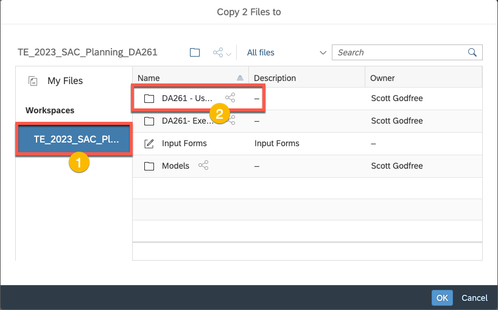

# **Getting Started**

**Objective:** Learn basic navgiation within SAP Analtyics Cloud, and copy the necessary content in preparation for the upcoming exercises.

**Estimated Time:** 5 min

**Exercise Description:** Before we get started on the exercises, we
will introduce the homepage of SAP Analytics Cloud and show where you
can access your files and dashboards for the exercises.

**Key Outcomes:**

- Locate your files
- Create a copy of the starting dashboards to your local file
  repository.

⚠️**Disclaimer** When completing exercises, it is expected that data
values or screenshots should match what you see on your screen unless
otherwise noted below. If you see inconsistencies as you work through
the exercise, please refer to the appropriate section in this document.
For any inconsistencies which are not addressed, please check with your
instructor.

🚩 Welcome to SAP Analytics Cloud! This is the homepage where you can
explore a sample story, create your first story, change your profile
settings and so on.

1. First, you want to access existing dashboards that we have created
   for TechEd. In the left-side panel, click the **Files** icon.

2. The stories that you will work on are located within
   the  **DA261 – Exercise Content** /**Starting Dashboards** folder within
   the Workspace  **TE_2023_SAC_Planning_DA261** .   First select the appropriate workspace and
   click on the **DA261 Exercise Content** folder.

3. Within the
   folder you will see several folders and a single file.  Let's start by creating a copy of the **Starting
   Dashboard** (within that folder are dashboard samples checkpointed at
   the start of each exercise) and the **DA261_SALESPLAN_QUANTITY.xlsx** file.  We will copy these to a specific folder
   (which you will create) for your user under **User Dashboards** folder.
   First select the **Starting Dashboards** folder and **DA261_SALESPLAN_QUANTITY.xlsx**
   file.

4. Click on the **Copy To** icon

5. Click on **TE_2023_SAC_Plannning_DA261** to navigate back to the
   root folder. Click on the **DA261- User Content** folder

6. Click Create new folder

7. Enter your UserID to create the folder (e.g., UserXX
   where XX is your specific user number.
   This will be used in place of  **Lester** , which is used in this walk-through)
   and click **OK

8. Click on the
   newly created folder to open the folder within the **Copy Folder to**
   dialog, and then click **OK** to copy the files

9. Navigate to the
   newly create folder by clicking on the **TE_2023_SAC_Plannning_DA261** Workspace
   followed by the **DA261 - User Content** folder

10. Now open the folder with your UserID (e.g., **USER01**)
11. Click on the file **DA261_SALESPLAN_QUANTITY.xlsx**, and select a location on your local machine to store the file (preferably on the Desktop).  Remember this location as you will utilize this file later in excercise 1.

12. Once the file download is complete, open the **Starting Dashboards** folder, and click on the dashboard, **DA261 – Dashboard – Exercise 1 –  Start**

13. Once the dashboard is open select the **Save As** from the File menu

14. Navigate back to the root folder for your user by clicking on your
    username in the file path at the top of the Save As dialog

15. Change the name of the file to **CycleBros -- FP&A Dashboard** and
    click **OK**

16. You are ready to begin!

**Summary**

**You have completed the Getting Started section! Now you are ready to
move on to the exercises.**

Please continue to [Exercise 1 - Plan Story Navigation and Enrichment](https://github.com/SAP-samples/teched2023-DA261/tree/main/exercises/ex1)
