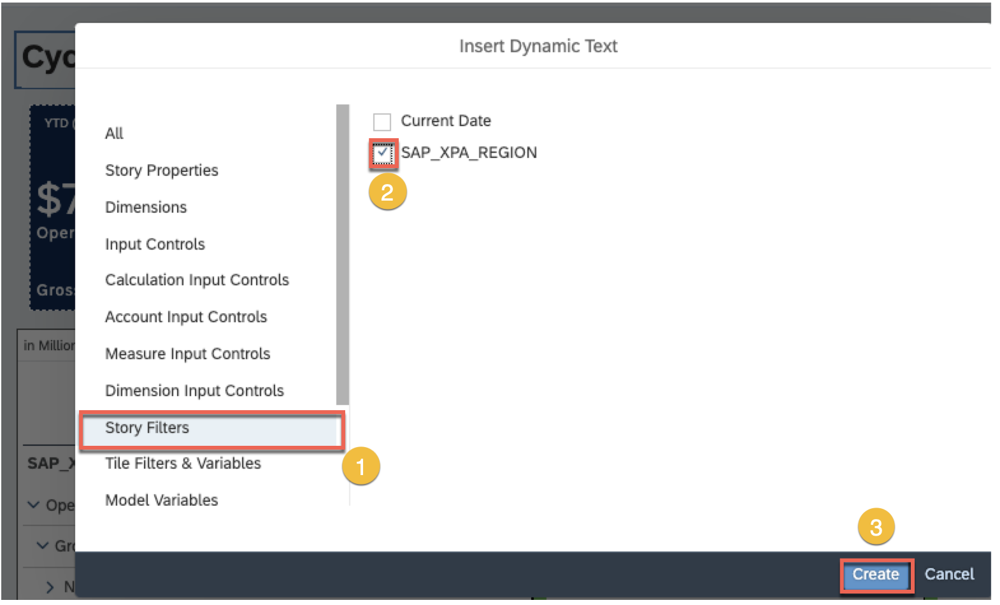
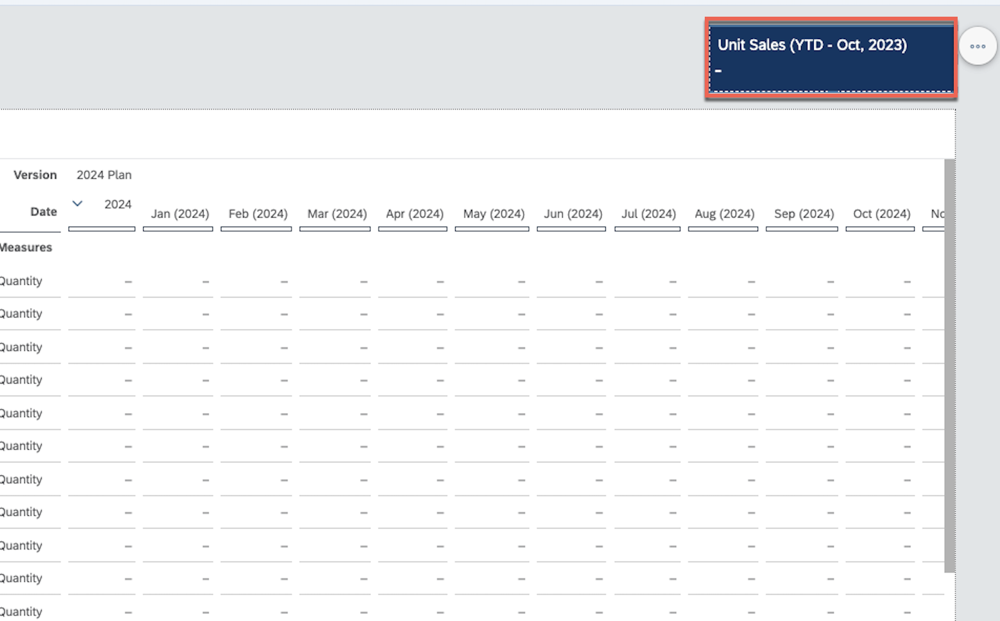
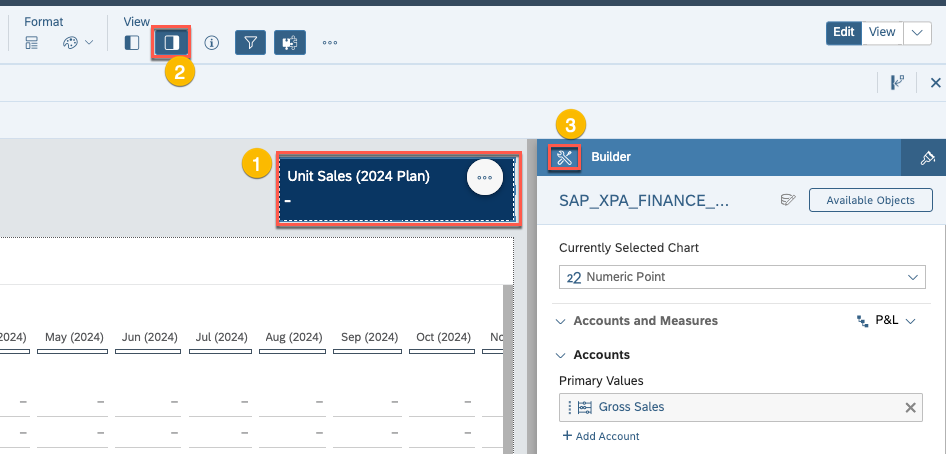
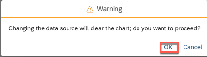
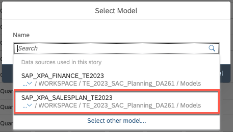
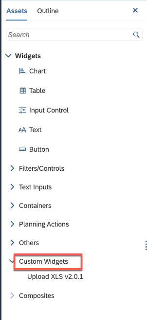

<link rel="stylesheet" href="styles.css" />
<h1 id="exercise-1-plan-story-navigation-and-enrichment">Exercise 1 –
Plan Story Navigation and Enrichment</h1>

<strong>Objective:</strong> You should develop an understanding of
basic story navigation, and how to modify a story to include new
visualiziations, change existing widget settings, and leverage custom
widgets and script to improve our planning template.

<strong>Estimated Time:</strong> 25 mins

<strong>Exercise Description:</strong>  CycleBros is a Germany
headquartered recreational bike manufacturer and distributor. You are an
FP&amp;A analyst for CycleBros, and you are looking to make changes to
existing dashboard to support the upcoming planning cycle, including
some customization for specific changes occurring in the US region and
end-user requested enhancements.

<strong>Key Features:</strong>

<ul>
<li>
Basic navigation of the dashboard
</li>
<li>
Inclusion of new widgets and minor changes to existing widget
settings
</li>
<li>
Introduction of a custom widget and script to support direct
end-user upload of planning data
</li>
</ul>

⚠️<strong>Disclaimer</strong> When completing exercises, it is
expected that data values or screenshots should match what you see on
your screen. If you see inconsistencies as you work through the
exercise, please refer to the appropriate section in <strong>Getting
Started</strong> Readme. For any inconsistencies which are not addressed
therein, please check with your instructor.

🚩As a FP&amp;A Analyst for CycleBros, we are interested in extending
the existing dashboard that incorporates Business Intelligence and
Planning. Start by reviewing the initial dashboard. You will notice that
we have 2 tabs. The tab first is tracking financial performance for the
current year (currently filtered to All Regions and the current close
period – Oct 2023). In the second tab, we have a sales plan entry
template which is meant to capture sales quantity forecasts by period
for each of products. Note that we have included a couple of input
controls (i.e., plan version and user) which are already selected and
are not meant to be modified during the exercise (this is to simplify
data capture and data segregation for TechEd). Additionally, for the
purposes simplicity we have narrowed the exercises to primarily focus on
the US region. We will make a couple of minor changes to dashboard
filters, while also making some additional enhancements to improve
end-user plan entry flexibility.

Let’s start by editing the dashboard!

<ol type="1">
<li>
First ensure you are on the Financial Overview tab. Then
click <strong>Edit</strong> to change the dashboard to authoring
mode.
</li>
</ol>

🚩 The first thing we want to do is make some end-user requested
changes to the Financial Overview page. This include updating the
dashboard title to dynamic reflect our region filter selection, changing
the default filter for region to focus on the US, and modifying the
default drill level for our P&amp;L in the table widget.

<ol start="2" type="1">
<li>
In the dashboard title text box, highlight the
<strong>DA261</strong> and click the delete key
</li>
</ol>

<ol start="3" type="1">
<li>
With your cursor between the brackets () right-click. Select
<strong>Add</strong> &gt; <strong>Dynamic Text</strong>
</li>
</ol>

<ol start="4" type="1">
<li>
From the Insert Dynamic Text popup, select <strong>Story
Filters</strong> and check the box for <strong>SAP_XPA_REGION</strong>
and click the <strong>Create</strong> button
</li>
</ol>

<ol start="5" type="1">
<li>
Now let’s change the default filter selection for the region by
clicking on the <strong>SAP_XPA_REGION</strong> filter at the top of the
dashboard and deselecting the <strong>All</strong> filter 
</li>
</ol>

<ol start="6" type="1">
<li>
Select <strong>United States</strong> and click <strong>Apply
Selections</strong>
</li>
</ol>

<ol start="6" type="1">
<li>
Finally, let’s change the default drill depth in our table by
first right-clicking on the <strong>SAP_XPA_ACCOUNT</strong> dimension
header within the table. Select <strong>Drill</strong> &gt;
<strong>Level 4</strong>
</li>
</ol>

<ol start="7" type="1">
<li>
Click <strong>File/Save</strong> to save your dashboard
updates
</li>
</ol>

⚠️<strong>Quality Check!</strong> Does your dashboard look like
this?

🚩 Now that we have updated the Financial Overview, we are next going
to make some preliminary changes to the Sales Plan Entry tab to prepare
for the upcoming planning cycle. We are going to add two new widgets.
The first will simplify review of total units planned, while the second
will introduce a custom widget to provide a mechanism for end-users to
directly upload their sales plan numbers from csv or xls.

<ol start="8" type="1">
<li>
Navigate to the <strong>Sales Plan Entry</strong> tab, and review
the template
</li>
</ol>

🚩 We want to add a a numeric point chart to track full year total
quantity planned. This number will ultimately be visible in the table as
well, but we want to make it more prominent the end-user. Rather than
inserting a net-new chart, we are going to duplicate an existing object
and repoint it.

<ol start="9" type="1">
<li>
Navigate back to the <strong>Financial Overview</strong> tab, and
select the Unit Sales numeric point chart
</li>
</ol>

<ol start="10" type="1">
<li>
From the widget menu select <strong>Copy &gt; Copy To &gt; Sales
Plan Entry</strong>
</li>
</ol>

<ol start="11" type="1">
<li>
Navigate to the <strong>Sales Plan Entry</strong> tab
</li>
</ol>

<ol start="12" type="1">
<li>
Move (click and drag) and resize the widget (select corner or
edge and click-drag) so the right side aligns with the right side of the
table widget so it appears similar to the screenshot below
</li>
</ol>

<ol start="13" type="1">
<li>
Highlight the <strong>YTD – Oct, 2023</strong> in the widget
title and click the delete key (note that the Oct, 2023 is dynamic text
referencing the Current Date story filter)
</li>
</ol>

<ol start="14" type="1">
<li>
With your cursor between the brackets () right-click. Select
<strong>Add &gt; Dynamic Text</strong>
</li>
</ol>

<ol start="15" type="1">
<li>
Select Input Controls, and check <strong>Version.</strong> The
click the <strong>Create</strong> button.
</li>
</ol>

<ol start="16" type="1">
<li>
Click on the chart (to ensure it is selected) and open the
<strong>Right Side Panel.</strong> If not already active, toggle the
<strong>Builder</strong> panel
</li>
</ol>

<ol start="17" type="1">
<li>
Click on the <strong>Select Model</strong> button in the Builder
panel
</li>
</ol>

<ol start="18" type="1">
<li>
Select <strong>OK</strong> on the resulting warning
message
</li>
</ol>

<ol start="19" type="1">
<li>
Click on the Select Model dropdown and choose the
<strong>SAP_XPA_SALESPLAN_TE2023</strong>
</li>
</ol>

<ol start="20" type="1">
<li>
Click the <strong>OK</strong> button
</li>
</ol>

<ol start="21" type="1">
<li>
Configure the builder panel as displayed in the image
below
</li>
</ol>

<ol start="22" type="1">
<li>
Navigate to the styling panel. Change the ID of the chart to
<strong>SP_US_FY_CHT</strong>. Hit the Enter key to commit the ID
change
</li>
</ol>

<ol start="23" type="1">
<li>
Click the widget menu for the numeric point chart. Then choose
<strong>More Options &gt; Show/Hide &gt; Primary Value Labels</strong>
to toggle off the Gross Sales label
</li>
</ol>

<ol start="24" type="1">
<li>
Click the <strong>File &gt; Save</strong> menu to save your
dashboard
</li>
</ol>

⚠️<strong>Quality Check!</strong> Does your Sales Plan Entry tab look
as follows? Note: the Plan_Contributor input control will reflect your
user ID

🚩 Now that we have made basic updates to the input template, we are
going to introduce some scripting components to leverage a custom widget
allowing end-users to directly upload a csv or xls from their local
computer.

<ol start="25" type="1">
<li>
Open the <strong>Left Side Panel</strong>
</li>
</ol>

<ol start="26" type="1">
<li>
Under the <strong>Assets</strong> menu, expand <strong>Custom
Widgets</strong>
</li>
</ol>

<ol start="27" type="1">
<li>
Select the <strong>Upload XLS v2.0.1</strong> and drag it into an
open space on the canvass near the top of the tab (note that the widget
label will disappear once you have finished positioning the
widget)
</li>
</ol>

<ol start="28" type="1">
<li>
From the insert menu let’s add a new <strong>Button</strong>
(we’ll use this to call our custom widget)
</li>
</ol>

<ol start="29" type="1">
<li>
Open up the styling menu of the button and change the settings to
the following
</li>
</ol>

🚩 Finally, we need to add JavaScript to trigger events in both the
custom widget and the button to call the custom widget. The custom
widget includes multiple custom events (part of the widget code itself),
but in the interest of time we will only populate two of these with
script. Upon click, the button we inserted in the previous step will
define a series of mappings (based on a predefined structure of the
upload file to the model we are uploading the data into), and then call
the custom widget. The custom widget has events to 1) display status
information during the file upload process, and 2) process the data into
the model once the file upload is complete including reporting any
errors and a reject file if some records are not loaded.

<ol start="30" type="1">
<li>
If it is not already visible, then open the Left Side Panel.
Select the <strong>UploadXLS_1</strong> which should appear within the
<strong>SalesPlanEntry</strong> page in the Outline menu
</li>
</ol>

<ol start="31" type="1">
<li>
Click on the <strong>Edit Scripts</strong> button and select the
<strong>onFileUpload</strong> event
</li>
</ol>

<ol start="32" type="1">
<li>
Paste the following Javascript into the function dialog:
</li>
</ol>
<blockquote>

<em>var sheets = UploadXLS_1.getSheetNames();</em>

<em>var records = UploadXLS_1.getTotalRows(sheets[0]);</em>

<em>var chunkSize = UploadXLS_1.getChunkSize();</em>

<em>if(records &lt;= chunkSize){</em>

<em>Application.showBusyIndicator('Uploading '+records.toString() + '
rows from the Excel file');</em>

<em>}else{</em>

<em>Application.showBusyIndicator('Uploading first
'+chunkSize.toString() + ' rows from the total '+records.toString() +'
in the Excel file');</em>

<em>}</em>

</blockquote>

<ol start="33" type="1">
<li>
Click on the <strong>Edit Scripts</strong> button and select the
<strong>onDataUpload</strong> event
</li>
</ol>

<ol start="34" type="1">
<li>
Paste the following Javascript into the function dialog:
</li>
</ol>

<em>SP_SALESPLAN_TBLE.getDataSource().refreshData();</em>

<em>Application.hideBusyIndicator();</em>

<em>var status = this.getUploadResult().jobStatus;</em>

<em>if (status ===
sdk_com_sap_sample_uploadxls__2_JobStatus.COMPLETED_WITH_FAILURES){</em>

<em>console.log(this.getUploadResult().failedRows);</em>

<em>this.downloadFailedRecords();</em>

<em>}</em>

<em>SP_US_FY_CHT.getDataSource().refreshData();</em>

<em>console.log(this.getUploadResult().jobStatus);</em>

<ol start="35" type="1">
<li>
Click on the <strong>Edit Scripts</strong> button and select the
<strong>onFailedUpload</strong> event
</li>
</ol>

<ol start="36" type="1">
<li>
Paste the following Javascript into the function dialog:
</li>
</ol>

<em>Application.showMessage(ApplicationMessageType.Error,'There was
an error uploading the Excel data');</em>

<em>Application.hideBusyIndicator();</em>

<em>console.log(this.getUploadResult());</em>

<ol start="37" type="1">
<li>
Select the <strong>BTN_UPLOAD</strong> which should also appear
within the SalesPlanEntry page in the Outline menu
</li>
</ol>

<ol start="38" type="1">
<li>
Click on the <strong>Edit Scripts</strong> button and select the
<strong>onClick</strong> event
</li>
</ol>

<ol start="39" type="1">
<li>
Paste the following JavaScript in the function dialog:
</li>
</ol>

<em>var modelId =
SP_SALESPLAN_TBLE.getDataSource().getInfo().modelId;</em>

<em>UploadXLS_1.setModelId(modelId);</em>

<em>var mappings = {</em>

<em>"SAP_XPA_ACCOUNT":"Account",</em>

<em>"Version":"Version",</em>

<em>"SAP_XPA_PRODUCT":"Product",</em>

<em>"SAP_XPA_BUSUNIT":"Org",</em>

<em>"SAP_LOB_REGION":"Sales Region"</em>

<em>};</em>

<em>var defaultValues = {</em>

<em>"SAP_XPA_MGR":IC_MANAGER.getInputControlDataSource().getActiveSelectedMembers()[0].displayId</em>

<em>};</em>

<em>UploadXLS_1.uploadData(mappings,defaultValues,true,"",false);</em>

<em>Application.showBusyIndicator('Uploading File...');</em>

<ol start="40" type="1">
<li>
Click the <strong>File &gt; Save</strong> menu to save your
dashboard
</li>
</ol>

🚩 In the final step of exercise 1, we will test our template
changes, including our upload widget. Recall where you saved the
SalesPlan_Quantity.xls file in the getting started section as we will
use that file for our testing. Also note that we have not fully coded
the upload button as we would in a production scenario (e.g., process
cancellation, error trapping) due to time considerations, so proceed
through these steps slowly. If you experience any issues, consider
reloading your story (<strong>View</strong> &gt; <strong>Reload this
Page</strong> in Chrome)

<ol start="41" type="1">
<li>
Click the View mode button to change from edit mode to view
mode
</li>
</ol>

<ol start="42" type="1">
<li>
Navigate to the <strong>Sales Plan Entry</strong> tab
</li>
</ol>

<ol start="43" type="1">
<li>
Ensure the page has fully loaded, and then click on the
<strong>User Upload</strong> button 
</li>
</ol>

<ol start="44" type="1">
<li>
From the file system dialog, locate the
<strong>SalesPlan_Quantity.xls</strong> file and click
<strong>OK</strong>
</li>
</ol>

🚩 At this point you should see a popup dialog indicating that 1008
rows are being uploaded from the Excel file. This upload may take a few
moments after which you should see the dashboard refresh with the upload
quantities.

⚠️<strong>Quality Check!</strong> Does your refreshed dashboard
(including upload results) look like this? Note: the Plan_Contributor
input control will reflect your user ID

<h2 id="summary">Summary</h2>

<strong>Congratulations, you have completed Exercise 1!</strong>

<strong>You are now able to:</strong>

<ul>
<li>
Make simple changes to an existing dashboard
</li>
<li>
Introduce additional charts and widgets into your
dashboard
</li>
<li>
Leverage JavaScript script to further tailor your planning
template
</li>
</ul>