# Exercise 2 -- Advanced Planning with Data Actions and Multi Actions 

**Objective:** You will develop a basic understanding how to create and
execute data action and multi actions. You will explore data action
tracing, which is useful for debugging data actions and will create
parameters to streamline the execution of data/multi actions

**Estimated Time:** 45 mins

**Exercise Description:**  Now that the sales quantity has been uploaded
to the sales model, we are going to create a data action to calculate
sales revenue and an allocation to distribute retail returns to the
product level based on our expected sales revenue. In the last step of
the exercise, we will transfer our sales plan to our financial plan.

**Key Features:**

-   Creation of data action to streamline calculations.

    -   Create data action parameters to streamline execution.

    -   Create a simple advanced formula for sales revenue calculation.

    -   Create an allocation rule to allocate retail expenses.

    -   Creating a cross model copy rule, which aggregates data based on
        region.

-   Executing a trace on a data action and reviewing results.

-   Creating a multi-action to orchestrate data actions.

-   Format trigger within the story and map parameters.

⚠️**Disclaimer** When completing exercises, it is expected that data
values or screenshots should match what you see on your screen. If you
see inconsistencies as you work through the exercise, please refer to
the appropriate section in **Getting Started** Readme. For any
inconsistencies which are not addressed therein, please check with your
instructor.

🚩As a FP&A Analyst for CycleBros, we are interested in automating the
calculation framework for our planning scenario. We will automate the
calculation via data and multi actions, which we will create as part of
this exercise. We will learn how to execute traces on data actions and
then how to include all this logic into a story.

Let's start by editing the dashboard to show the finance plan. This will
make it easy to eventually see how our sales planning activities
transfer to the finance plan near the end of the exercise.

6.  We are now going to adjust the layout of the sales planning table.
    Our first step will be select the table object, select edit mode for
    the story, the right design panel and then the builder panel. This
    will allow us to redefine the definition of the table object.

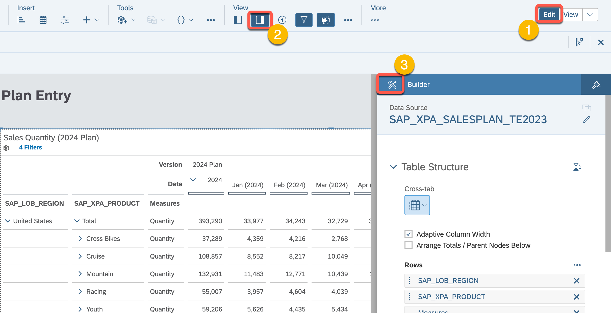

7.  Adjust the table definition to match the definition provided below.
    For **Account**, we will filter on Gross Revenue and for
    **Measures** we will filter on Quantity and Amount.

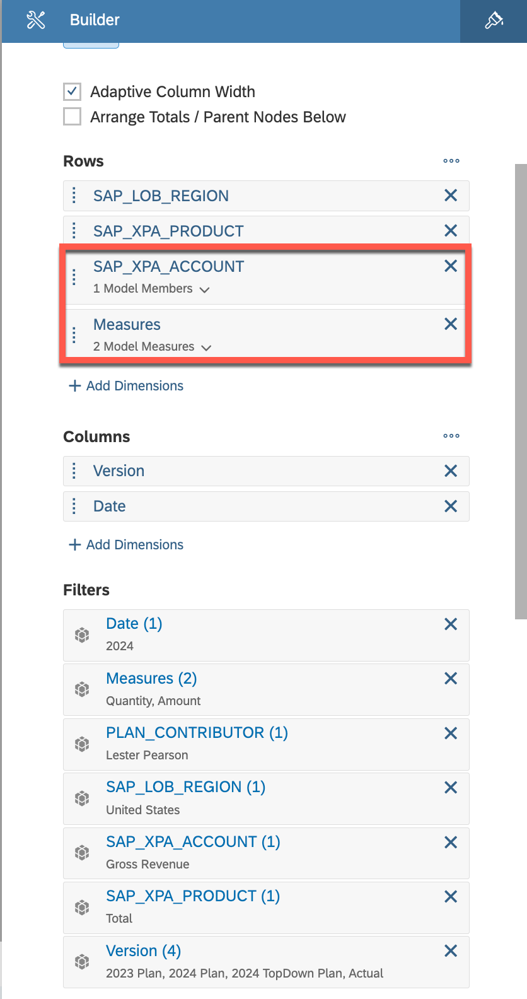

8.  We will enable null suppression to remove the null rows from the
    report.

9.  We will now collapse the hierarchy of the report so that we are only
    looking at an overview of our sales plan.

10. Once we close the right builder pane and resize the table, your
    results should look like this:

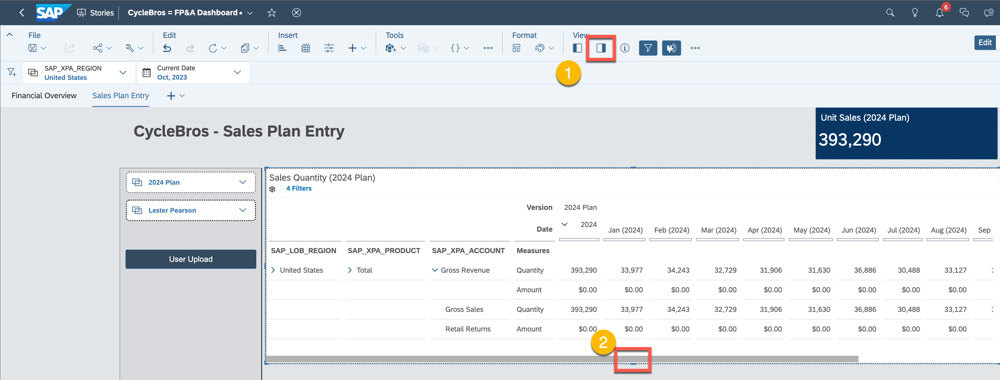

11. We are now going to create a table that shows our Finance data. As
    part of this exercise, we are going to integrate our sales plan into
    the finance plan so we will add a table showing finance data so we
    can showcase this integration. To begin, we will duplicate the Sales
    Quantity table, reposition it and then open up the builder panel so
    we can select our finance model.

12. Acknowledge the warning and then select the finance model.

13. Set the table layout and filters as shown

> 

14. Rename the table to Finance () and then add dynamic text between the
    "()" for the version.

> 

15. Select the Version item from the Input Controls selections.

> 

⚠️ **Quality Check!** Does your refreshed dashboard (including upload
results) look like this? Note: The right planning panel may need to be
de-selected from the meu to replicate this view.

16. Save your story.

> 

17. From the main menu, select **Files**, our **Workspace**, then
    DA261-User Content and then your user folder. We can now select the
    "+" button to add a Data Action. This data action will be used to
    calculate gross sales based on quantity and price. We will then
    extend this data action to allocate Retail Returns to the subregions
    of the United States based on our calculated Gross Sales values.

18. Enter a name like "Calculate_Sales\_&\_Returns" and select the Sales
    Model from the model folder within our workspace. This is the same
    sales model we were using when we were creating our story. When
    complete, save the data action to your folder.

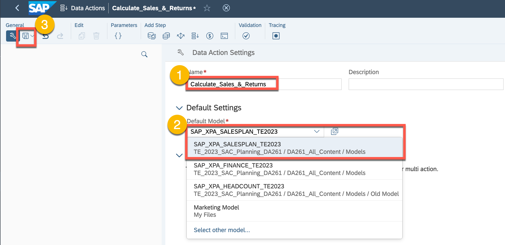

19. Validate that you are saving the data action to your user folder.

20. We are going to add an advanced formulae to calculate gross sales
    from quantity and price. We are going to open the content menu so we
    can restrict the scope of the calculation.

21. However, before we restrict the context, we are going to create a
    parameter to restrict the calculation to our user id.

22. Give your parameter a name like "User" and then make the appropriate
    settings as shown. When complete save your Data Action. Select the
    advanced formula item that we were starting to configure before we
    created our parameter.

23. Give the step a name like "Calculate Sales". Next configure the
    context as shown. Note that for the PLAN_CONTRIBUTOR. You will need
    to select the USER parameter you have just created from the
    parameter list within the selection popup. Once the context is set,
    we will start the process of building a graphical calculation to
    calculate gross sales.

24. We are going to calculate the Gross Sales Amount by taking the
    price, which is stored at the Unassigned region multiplied by the
    sales quantity we uploaded from our excel file.

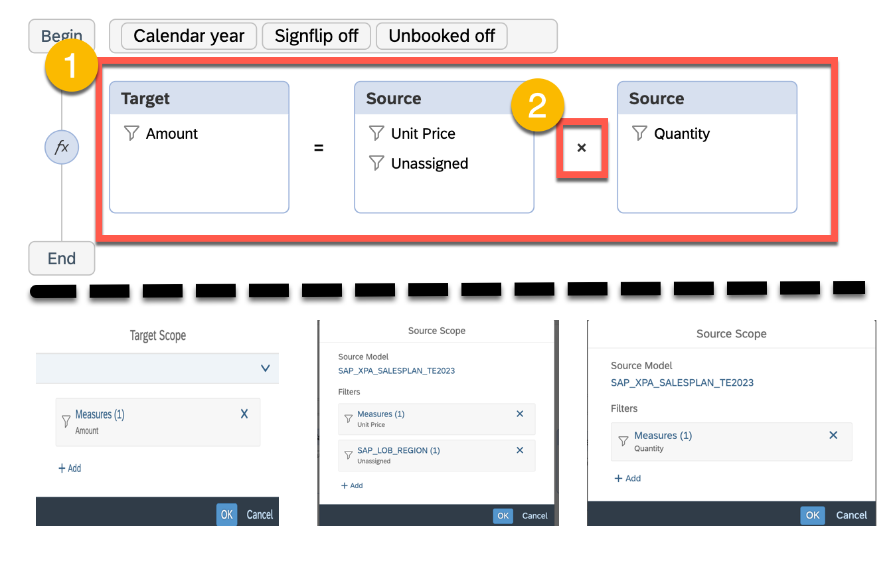

⚠️**Quality Check!** Please check that your advanced formula is
identical to what is shown below.

25. We are now going to add an allocation step so that we can allocate
    retail returns to our sub-regions (i.e. North, East, South and
    West).

26. Configure the allocation rules as shown and then save your rule. In
    this case, we have already planned retail return values for 2024 for
    the entire region, which is stored in the Unassigned region. We are
    going to allocate these values by the gross sales we previously
    calculated for each subregion.

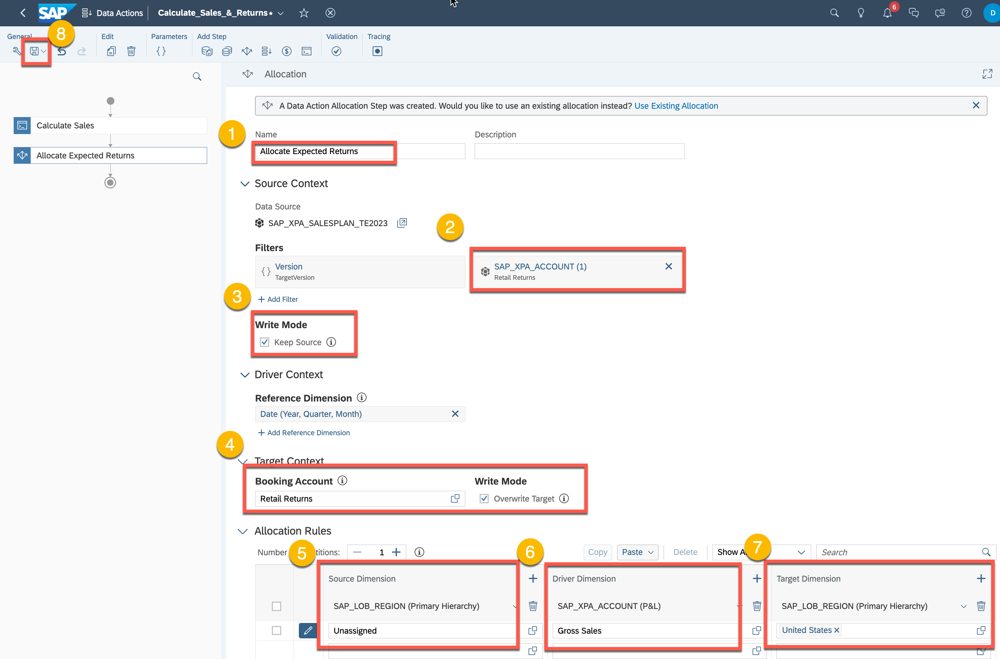

27. We are now going to set the trace points on the data actions.

28. Set the trace points as shown by selecting these areas on the data
    action flow. This will allow us to see data action changes between
    steps.

29. We can also select trace points within advanced formulas. Here we
    are going to set a trace point where we are calculating gross sales.
    Notice that we also see a new tracing point added on the Tracing
    pane on the right side of the screen.

30. Please select the 2024 Plan and your User ID for the data input
    parameters.

31. We are now going to select the Show Table to Review the results of
    the first step. Notice that our selection parameters will be shown
    in the right pane for transparency.

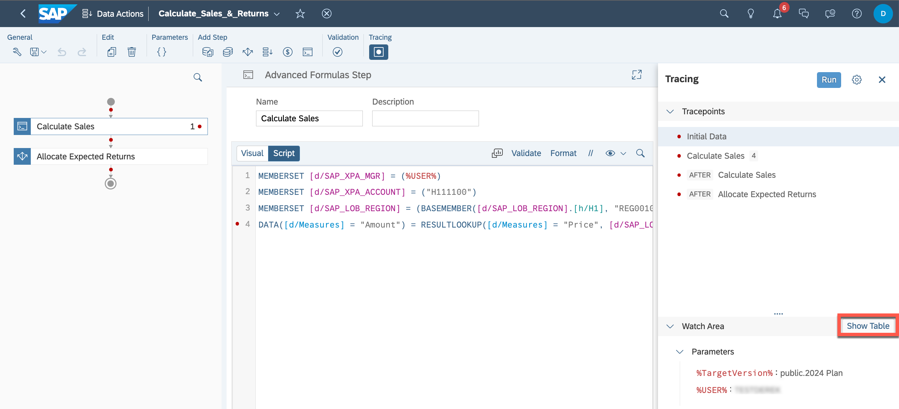

⚠️**Quality Check!** Please check that your trace window should be
identical to what is shown below.

32. As we configure the table, you may need to change the **Display
    Options** to **Description**.

33. Configure the table as shown. Notice that price is stored at the
    unassigned region and that the Amount has not been calculated.

34. Select the tracing point for Calculate_Sales. Here we will see the
    results tracepoint for the calculation we created in our advanced
    formula. If we had multiple calculation lines in our advanced
    formula, we could have set multiple trace points. Also note that we
    can also explore the calculation scope for our advanced formula on
    the right pane.

35. If you would like, you can also select values from the Watch Area
    table and use the copy button to copy them to the clipboard. These
    values can be then pasted into a document like Excel for further
    analysis. While we are showing this capability, we have not included
    exercise steps to paste these values into other documents.

36. Next, we are going to select the tracing steps after our
    Calculate_Sales advanced formulas has executed. As we only have one
    calculation in our advanced formula, the results of this table
    should match the previous trace point. Notice that we do not see any
    values for Retail Returns as this will be addressed in our
    allocation step.

37. Selectin the AFTER Allocate Expected Returns, we can see that the
    Retail Returns from the unassigned region (i.e. '#'), to each of the
    subregions based on Gross Sales.

38. The Trace creates a private version, which can be viewed in the
    story we created. Since we will not be doing anything with this this
    trace version we will delete the information.

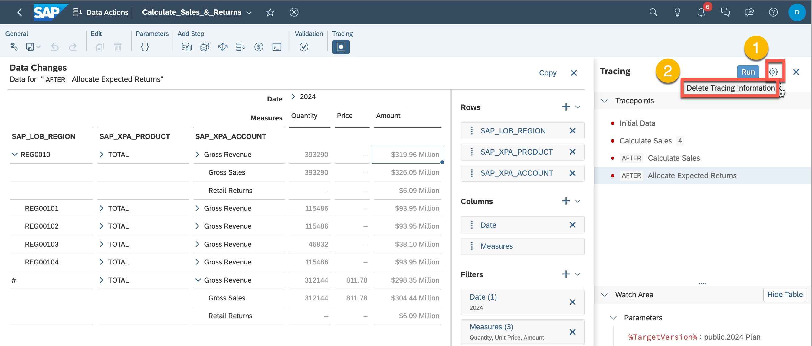

39. In case you have not done so before, please **Save** your data
    action. When we created the data action, we did it from our personal
    folder we created in our workspace. As the next step, we are going
    to create another **Data Action** to load the sales plan into the
    finance plan. We will perform this step from the main menu to
    initiate the build activity and then save it to our personal folder.

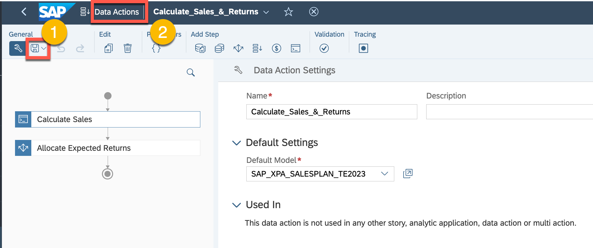

40. Xxxx

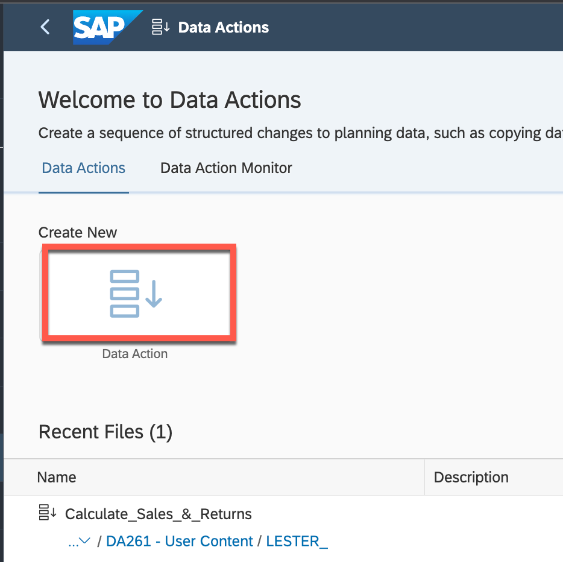

41. Please give the data action a name like " Cross-Model Copy Step" and
    then select our Finance model from the exercise.

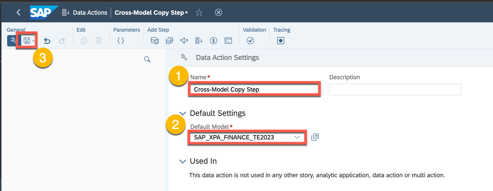

42. We are going to save this data action to our personal folder. Note
    that when creating models, stories and data/multi-actions, that
    these objects can be stored within a file structure for easy
    organization.

43. We are going to create some parameters for the data action. This
    will allow us to better control the scope of the data action.

44. To create a parmeter, we will give it a name, set the model to our
    sales planning model (i.e. SAP_XPA_SALESPLAN_TE2023). We will then
    select our dimension (i.e. PLAN_CONTRIBUTOR) and set the cardinality
    to single (vs. multiple values) and the level being a leaf member.
    As the sales plan for the purpose of this exercise is organized by
    user, this will allow us to pass our user to the data action to
    restrict its scope.

45. We are going to create another parameter for source version. As we
    are creating a data action to copy data between models, this
    parameter will be used to indicate which version we would like to
    copy from the sales plan.

46. Please give the parameter a name, such as "SVersion" and set the
    model to SAP_XPA_SALESPLAN_TE2023. We are going to assign the
    dimension to Version and the cardinality to single, which means we
    only want to pass a single value via this parameter. We will then
    enter the default value of "2024 Plan." Although we have set a
    default value, the user can override this value when the data action
    is executed.

47. We are now going to create our **cross-model copy** step to copy
    data from our sales plan to our finance plan.

48. Please give the parameter a name, such as "**Sales 2 Finance**" and
    set the model to SAP_XPA_SALESPLAN_TE2023. We are going to assign
    set the filters for **Version** and Plan **Contributor** as shown.
    When selecting the filter value, you will need to select
    **Parameters** on the pane on the left side of the popup window to
    select the parameters you have previously created.

49. Using drag and drop, map the source dimension to the target
    dimensions. Note that you will not be able to map SAP_XPA_COSTCENTER
    as this dimension is not included in the finance model. We will want
    to select this dimension and manually map it to the **Sales &
    Marketing** cost center.

50. Select the measures mapping so we can edit the mapping rules.

51. We are going to create a user defined rule to map the Amount from
    the sales plan to Local Currency in our finance plan. We are also
    going to set the auto-generation strategy to "**Identical Names and
    Compatible Types.**" We could have also filtered on measures when
    creating the rule to just include Quantity and Amount as well.

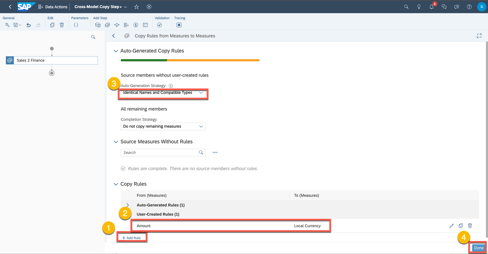

52. Now select the SAP_LOB_REGION. Here we have the issue that we have
    sub-regions assigned to the United States in our sales plan that
    have been aggregated to just the United States in our finance plan.

53. For the region, select "Identical names (including Ancestors)" to
    map the subregions from the sales plan to the region in the finance
    plan. Using this strategy, we can plan at a different level in our
    sales plan than our finance plan.

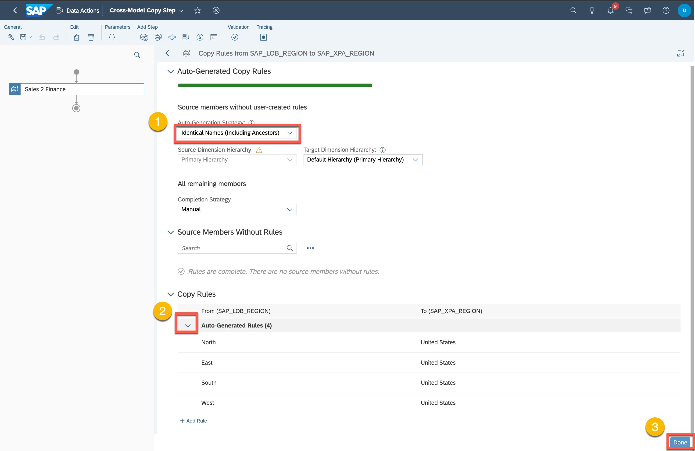

54. If you have not already done so, please save your plan and then
    select the **Multi Actions** from the main menu as shown. With the
    multi-action, we can bind data actions that we created for our sales
    and finance model into a single action we can trigger in a story.

55. We are going to create a new Multi Action.

56. Before we add the data actions we previously created to our
    multi-action, we are going to create some parameters to orchestrate
    the execution.

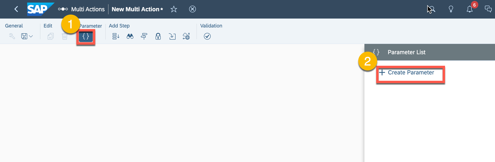

57. We are going to create parameter called "SVersion" that will be used
    transfer what source version we would like to use from our sales
    plan. Please enter the values as shown below.

58. We are now going to add another parameter for our userID. While we
    would not normally run a data action by user id, we have added this
    parameter as we have many participants running data actions for this
    exercise and want to carefully limit our scope.

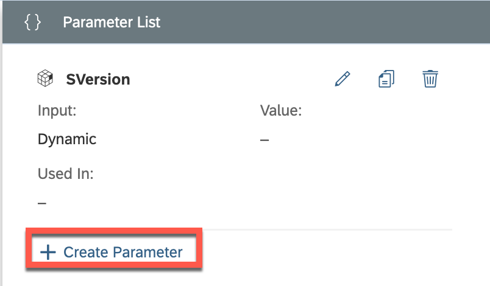

59. Please create the parameter as shown below.

60. We are now going to create another parameter for the target version.
    Note that for this exercise we could have just hard-coded these
    values, but have chosen to include them as parameters to make them
    more dynamic.

61. Please create the version as shown below.

> 

62. Select the + button and then add a **Data Action Step**. This is
    where we will start to attach the data actions we previously created
    to the multi-action.

63. Select the data action that you have previously created, which
    should be stored in your user folder. Please configure the
    parameters as well.

64. We will now add another data action to our multi action. Note that
    when we create a data action, we can only assign a single model to
    it. When using a multi action, we can include many data action steps
    to it, which may be bound to different models. Our first data action
    is bound to the sales plan, whereas our second data action will be
    bound to the finance plan model.

> 

65. Configure the data action as shown and then save the multi-action.
    you will need to save the Multi Action to your personal folder,
    which will be shown in the following step.

66. Save the Multi Action to your personal folder. Please give it a name
    like "Calc_Sales_and_Aggregate"

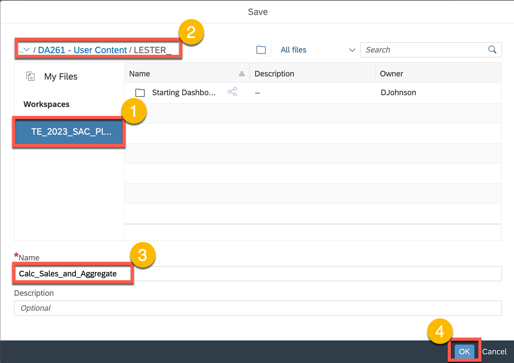

67. Open your main user story that we created in the first part of the
    exercise.

68. Navigate to the second page of the worksheet related to **Sales Plan
    Entry** and then select the **Edit** button. We need to be in edit
    mode to add our newly created multi-action into our story.

69. Add a **Multi Action Trigger** as shown below.

> 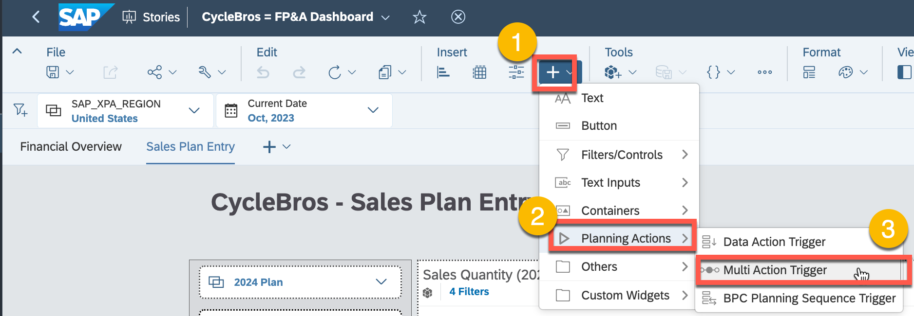

70. Open up the right editing pane and then select your multi action
    that you have just created form your personal folder. Assign the
    parameters as shown below. Press the formatting button so we can
    format the trigger in the next step.

71. We are now going to format the trigger. While you are free to select
    any color, we have provided a hex number as well for a particular
    shade of blue.

72. Please reposition the Multi Action and then **Save** your story. We
    will then select the **View** mode as we get ready to execute the
    Multi Action.

Navigate to the Sales Plan Entry Page.

⚠️**Quality Check!** Please check that your sales story page should be
identical to what is shown below.

73. Press the **Multi Action** button to execute it. The prompts in this
    case should be 2024 Plan for both the source and target version.

74. We should now see the sales plan values transferred to the finance
    plan. We can expand the hierarchies to get a better sense of the
    plan transfer.

## Summary

**Congratulations, you have completed Exercise 2!**

**You are now able to:**

-   Create and execute data and multi-actions.

-   Perform tracking on data action steps.

Continue to Exercise 3 - XXXXXXXXXXXX
