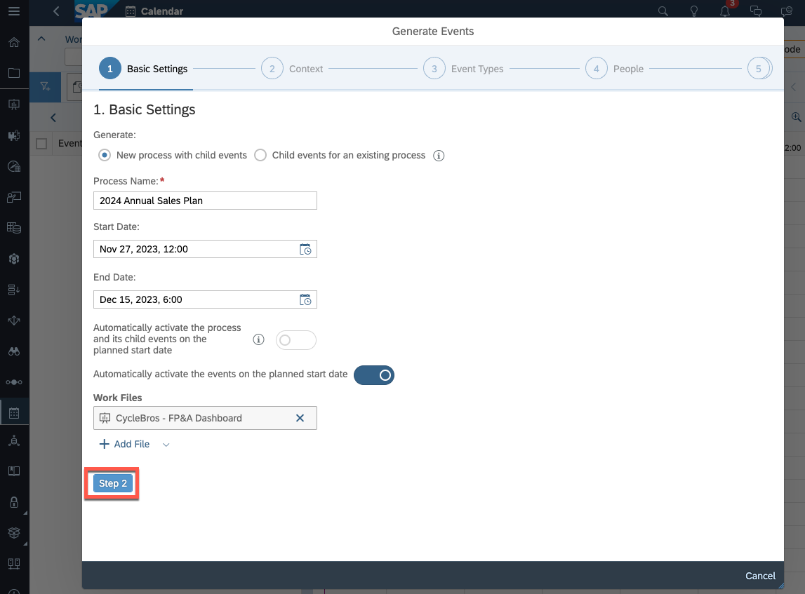
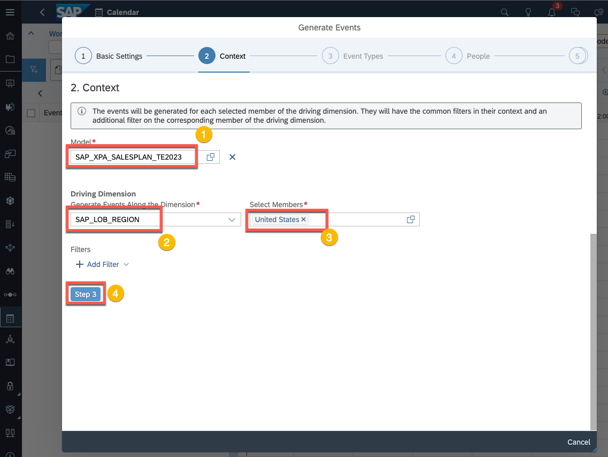
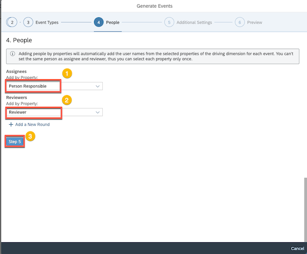
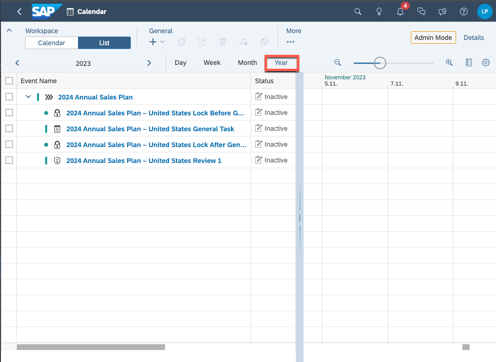
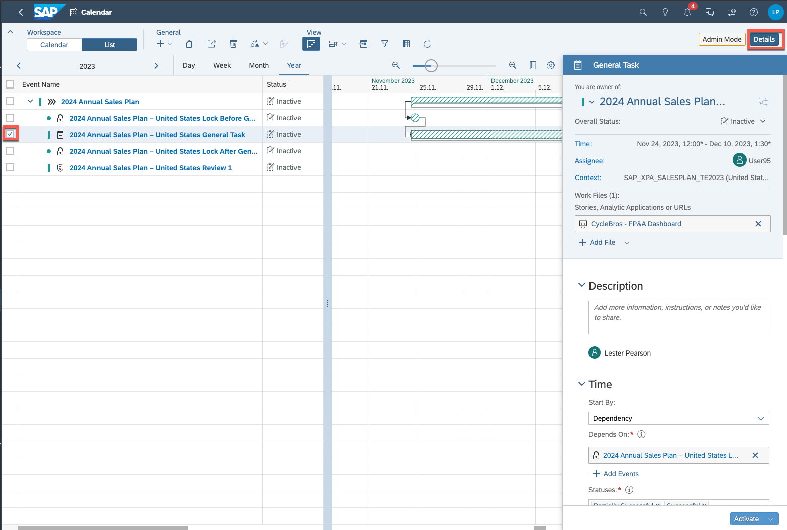
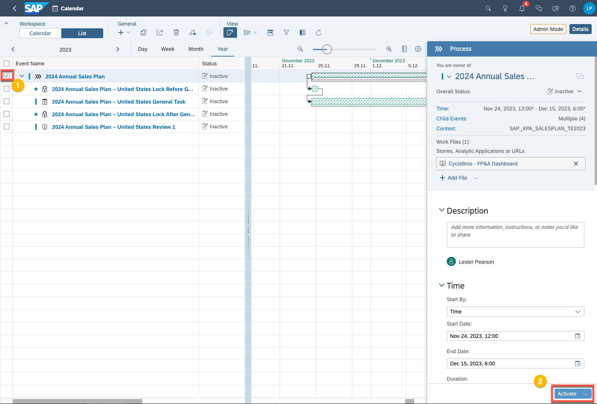
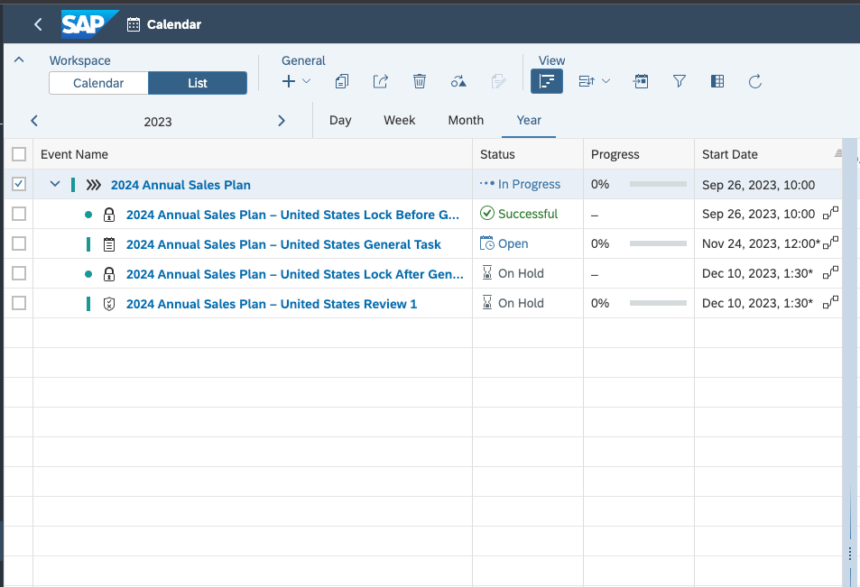

# Exercise 3 - Leveraging the Calendar for Plan Workflows

**Objective:** In this exercise, you will explore the calendar,
and create a submission and review task based on the output of exercises 1
& 2

**Estimated Time:** 15 mins

**Exercise Description:**  Now that we have created our dashboard and input template,
and create a process to aggregate the plan results, we will create a simple
calendar process to simulate to a plan submission workflow.  Note that in this exercise we will only generate
the tasks due to the complexities associated with multiple sign-ins required to
step through the actual submission process.

**Key Features:**

* Utilize the Calendar Wizard to create and assignee
  and review tasks for plan submission

⚠️**Disclaimer** When
completing exercises, it is expected that data values or screenshots should
match what you see on your screen.  If
you see inconsistencies as you work through the exercise, please refer to the
appropriate section in **Getting Started** Readme.  For any inconsistencies which are not
addressed therein, please check with your instructor.

🚩As a FP&A Analyst for CycleBros, we are interested in
generating a managed contribution workflow to allow for an end-user to capture
their plan and then get that plan approved.
We will utilize the SAC calendar for this purposed.

Let’s start by launching the calendar.

114. Expand the Navigation Bar

115. Select
     Calendar

🚩 Welcome to
the Calendar! This where you can create user driven tasks and execute automated
system tasks based on specific calendar dates and times.  Note that you may have received a
notification about a next task status filtering option.  If you did, you will likely see a pre-filter
already setup based on task status (you can see this below).  You are likely to see a blank calendar as no
tasks have been configured for your user (either as a task owner, task assignee,
or task reviewer).   We are going to
create some tasks in this exercise.

116. Under
     the General toolbar item, click the **+** and select **Generate Events with**
     **Wizard**

🚩 Welcome to the Calendar Wizard! From here we can utilize
various parameters to create many assignee and review tasks which essentially represent
a larger submission workflow to cover an entire planning process, or a
subprocess.  In our case, this workflow
will be very simplistic and could be create manually using the General and
Review Task options visible in the menu item above.  However, we will utilize the Wizard to
illustrate its capabilities.

117. From the Basic Settings step, configure the following settings.  For Process Name, Start Date, and End Date
     feel free to use those provided in the image, or set your own

118. Click
     the **Add File** under the Work Files

119. We want to attach the dashboard we finalized in exercise 2 to the tasks we are
     going to create.  Location and select the
     **CycleBros – FP&A Dashboard ** (you will have to navigate to your folder
     in the TE_2023_SAC_Planning_DA261 Workspace).
     Click the **OK** button.

     

120. Navigate
     to  **Step 2** .

🚩 Notice
that as you navigate through the Wizard, your current step is illustrated as a
process flow at the top of the dialog.  At
any point in time, you can navigate backward or forward (up to the most next
step you need to complete) by either clicking on the specific step in the process
flow or using the scroll bar on the right of the dialog.  Feel free to test this.

121. For the Context, populate the Model
     and Driving Dimension filters as follows, and then navigate to Step 3.  Note that you can find the model in Models
     folder in the TE_2023_SAC_Planning_DA261 Workspace.

122. The **Event Types** step allows us
    to define the specific types of tasks we want to configure.  In our case we will select General Task and Review
    Tasks, and we will also include a Data Locking Task and create an overriding
    process group for our tasks.  Configure
    the Event types step as follows.

🚩 The Event
Types dialog allows us to configure either discrete tasks for submission and approval
or utilize a composite task which combines both the submission and approval in
a single task.   You can find more information on the various
types of calendar events in the online help: [https://help.sap.com/docs/SAP_ANALYTICS_CLOUD/00f68c2e08b941f081002fd3691d86a7/dafaffbb3f9441b7a41fd824fea53841.html](https://help.sap.com/docs/SAP_ANALYTICS_CLOUD/00f68c2e08b941f081002fd3691d86a7/dafaffbb3f9441b7a41fd824fea53841.html).  In general, the discrete tasks (represented
as separate general and review tasks) tend to provide more flexibility as you
can configure more specific parameters within each separate task, and can included
others types of tasks as intermediary steps with dependencies We will see this
in a moment with the inclusion of data locking tasks.  We have enabled the option for Data Locking
tasks and can selectively include one or more at various phases of the submission.  With discrete tasks we can do this before the
General Task, After the General Task, and/or After All Tasks (i.e., all tasks
in a subprocess).  If we had selected a Composite
Task, then we only could insert a Data Locking task before the Composite Task
and/or after the Composite Task (not after the preliminary data submission).  The “Create process for groups of tasks” was not
selected in our scenario as we only have a single node that will be submitted,
but this setting is best enabled to create an overarching process when there
will be multiple nodes submitted/reviewed.

123. In the People dialog, we will and
     owner for the submission/assignee task and an owner for the review task.  These will come directly from properties associated
     with the driving dimension (SAP_LOB_REGION) we selected previously.  Select the following properties for Assignees
     and Reviewers.  Then click the button for
     Step 5.

🚩 In the People
dialog, you will also note that we have the option to “Add a New Round”.  We would use this if we need a given
submission approval to pass through multiple reviewers in a sequential approval
chain.

124. In the Additional Settings dialog, we
     have the option to make some changes to the task names and descriptions for the
     events that will be generated.  We will
     not make any adjustments here.  When
     ready click the button to navigate to Step 6.

125. Review the contents of the preview dialog.

🚩 As represented
in the preview dialog,
there will be two data locking tasks generated.
“You” will be the owner of these tasks (i.e., because the task is an
automated task, it is assigned to your userid as the creator of the task).  The other tasks include a general
(contribution) task and a review task for the United States.  These tasks are assigned to User95
(contributor) and User99 (Reviewer).  As
we have separate tasks for submission and review, the relevant users are
considered Assignees.  Had we created a
composite task (integrated general and review task) then User95 would have
appeared as the “Assignee” and User99 would appear as a “Reviewer”.

126. Click the **Generate** button to
     create the calendar tasks

127. Once you receive a notification that the
     5 events have been created, please click the refresh button on the toolbar.

128. Change the calendar time range to **Year
     **if it is not already select.

129. Move the time scale within the Gantt
     chart to zoom out slightly, and adjust the the time slider within the Gantt
     chart to center chart until your screen clearly shows the full task list and a
     graphic representation.

🚩 Now we
have created a process hierarchy! You will see that all the tasks are set as
Inactive as the predefined start date hasn’t yet arrived.  The process and the tasks (based on dependencies
– represented through arrows linking the tasks in the Gantt chart).

130. Select the General Task in the task
     list and activate the Details side panel.

🚩 You can
see in the General Task side panel, details about the given task.  Included is basic information about the task
(dates, assignee, context) as well as any Work Files that have been included
for the assignee.  In this case, as
illustrated in the Gantt Chart, the General Task is dependent on the previous
Data Locking Task having been completed with either a Successful or Partially
Successful status (note that the task would be time based if not driven by
dependencies).  In addition to adjusting
a given task on the Details side panel, you could also pull up and change dependencies
directly from within the Gantt chart by double clicking on the arrow linking
two tasks or change the start date of a task using the Gantt chart by clicking
and dragging the task left or right.  Feel
free to review the other settings in the detail panel of the task.  For our final step we will illustrate

131. Let’s go ahead and activate the process (rather than wait
     for a potential future start date).
     Select the parent process and click the Activate button.

132. In the Activate dialog select the Activate process
    (without role transfer).  Click the
    Activate button.

🚩 In the above
case we do not need role transfer to be applied because we already have sufficient
assignments within the individual tasks.

⚠️**Quality Check!** Does
your calendar look similar to the following (note that the dates will differ based
on the current date on which the process was activated)?

🚩 The overriding
process should now display as “In Process”, and the first child task which is
the preliminary Data Locking Task should have been executed successfully (it is
set as an automated task and does not require any user intervention).  You will also notice that the General Task is
now Open and available for plan entry/submission, and the subsequent tasks are On
Hold pending completion of the General Task.

## Summary

**Congratulations, you have completed Exercise 3!**

You are now able to:

* Navigate the Calendar
* Use the Calendar to create and track plan
  submissions
